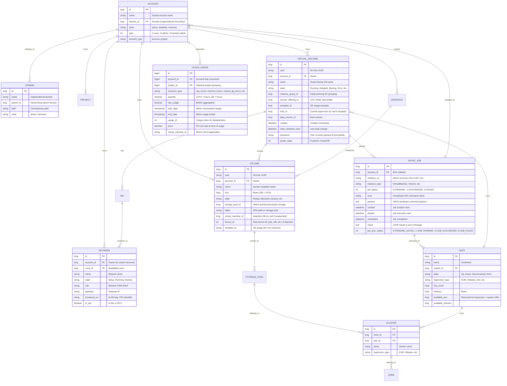
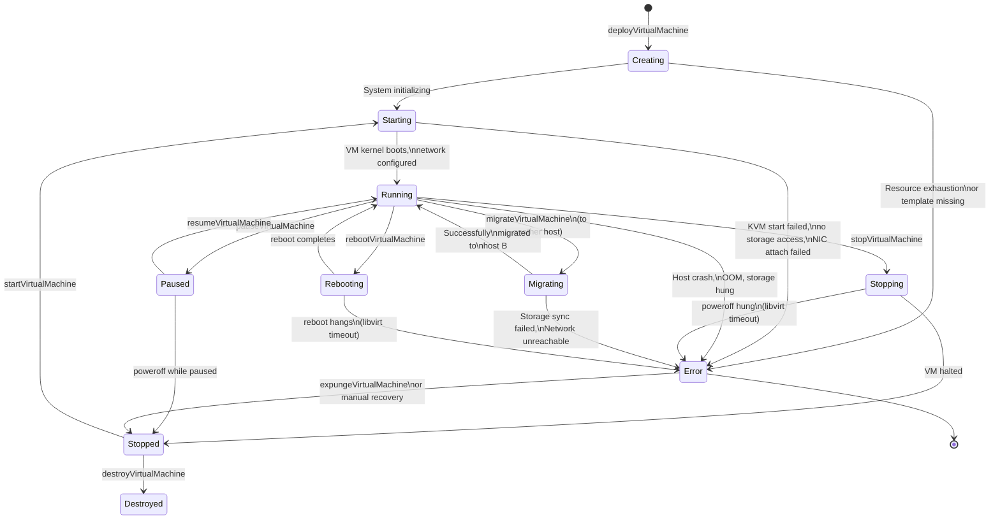
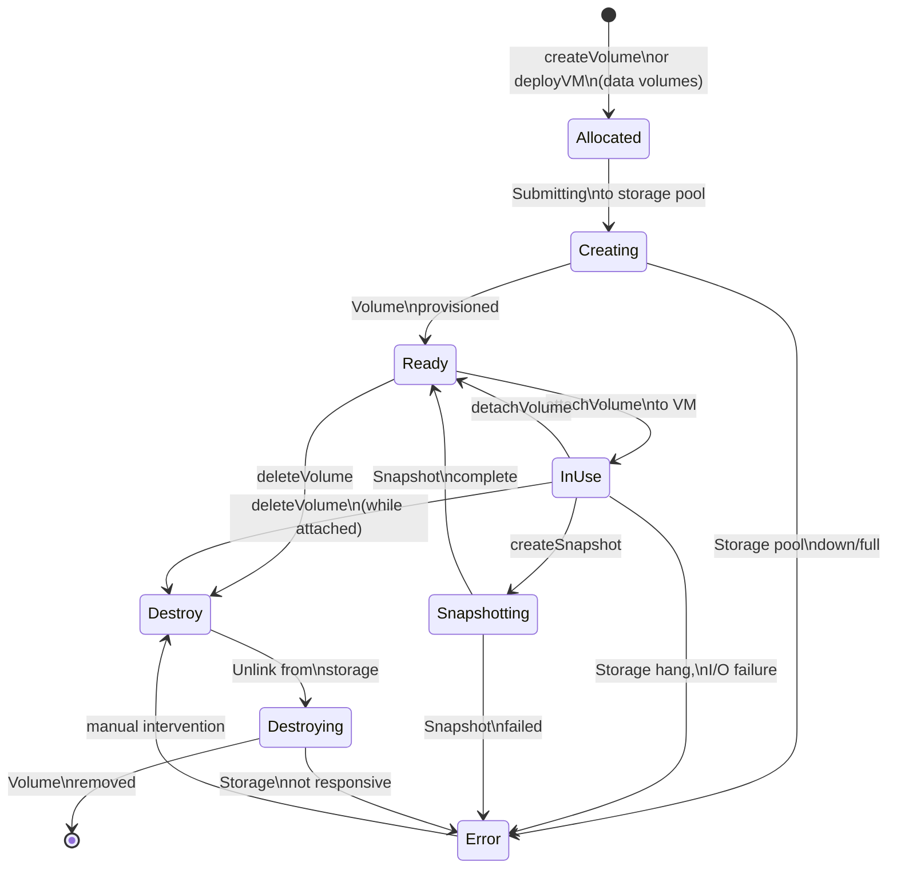
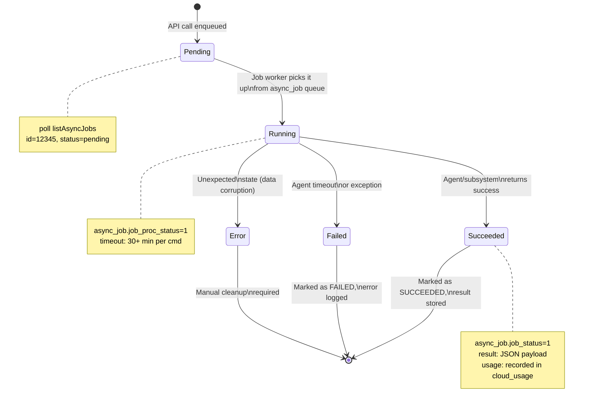
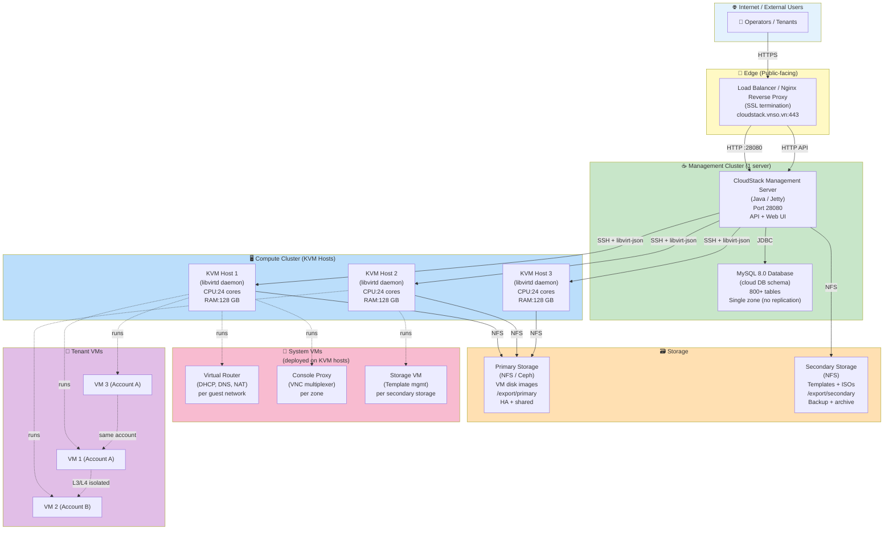
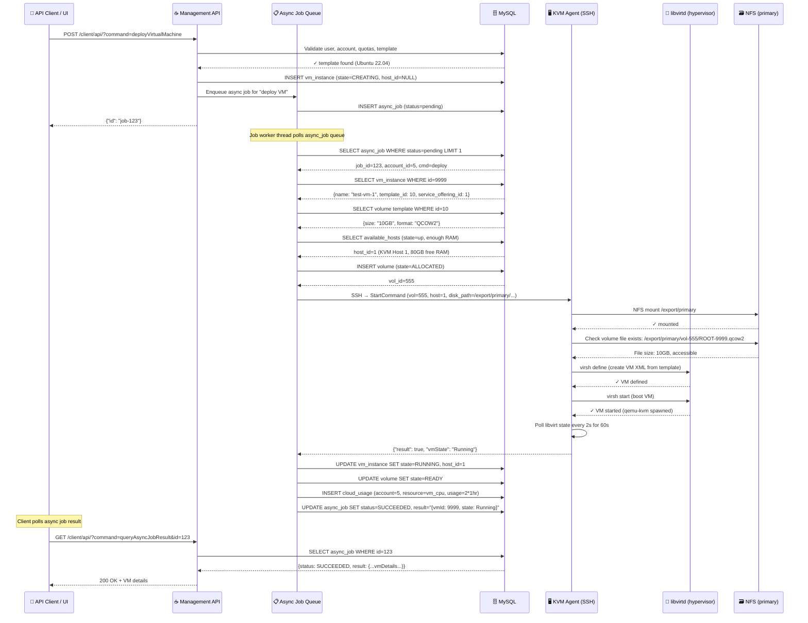

# Apache CloudStack (VNSO Distribution) — v2 PRO AI Context Pack

> **Version:** 4.23.0.0-SNAPSHOT (VNSO fork) | **Risk Class:** critical-revenue | **Last updated:** 2026-05-04

**Purpose.** Single-source-of-truth context for AI agents, engineers, and auditors working on VNSO CloudStack IaaS platform. Read this **fully** before making infrastructure or billing changes. Contradictions: **code is authoritative**; update this file immediately.

**Hard constraints:**
- Admin credentials must be injected via environment variables (`CLOUDSTACK_ADMIN_USER` / `CLOUDSTACK_ADMIN_PASS` in `.env` or CI/CD secrets). **Never hardcode credentials** in migrations, seeds, scripts, docs, or examples.
- All monetary/billing operations must be idempotent (events must replay safely).
- No multi-region global state; each zone is independent.

---

## 0. TL;DR (30 seconds)

**What.** VNSO CloudStack (4.23.0.0-SNAPSHOT) — multi-tenant IaaS orchestration platform enabling VM provisioning, network/storage management, billing, and self-service portal across KVM/VMware/XenServer hypervisors.

**Why.** Organizations build private/hybrid clouds with API-driven orchestration, elasticity, multi-tenancy (via accounts/domains/projects), and usage-based revenue billing.

**Status.** v1 production (3-4 server deployments); v2 planned (Kubernetes-native, enhanced plugin ecosystem, HA management).

**Surface.** REST API (`/client/api/`), Vue 3 Web UI, Mobile (Capacitor), Desktop (Electron), CLI (cloud-cli), and system VMs (Router/ConsoleProxy/SecondaryStorageVM).

**Risk.** **critical-revenue** — entire customer infrastructure lives here. Billing accuracy, host availability, storage durability are revenue-critical. One management server loss = operations blind; one primary storage loss = all tenant VMs unbootable.

---

## 1. AI Quick Index

| Topic | Location | Audience |
|---|---|---|
| **Minimum deployment** | §12.1 | Operators first-time setup |
| **API request examples** | §8.2 | Backend engineers, API consumers |
| **Failure modes to watch** | §10 | SRE, on-call engineers |
| **VM lifecycle** | §7.1 | Support, troubleshooting |
| **Billing pipeline** | §9.3 | Finance, DevOps |
| **Network isolation** | §6 (Data Model) + §13 | Security, compliance |
| **Async job lifecycle** | §7.3 | Backend devs, job queue tuning |
| **Database schema key tables** | §6 | Schema migrations, analytics |
| **Runtime credentials** | §5 + §13 | Deployment, CI/CD |
| **Smoke tests & validation** | §15 | QA, continuous integration |
| **Runbook: prod incident** | §16 | On-call SRE |
| **Observability hooks** | §14 | DevOps, SRE tooling |

---

## 2. Repo Topology

```
/root/cloudstack/                           ← VNSO fork (4.23.0.0-SNAPSHOT)
├── client/                                 ← Web UI (Vue 3) + Management Server (Java/Jetty)
│   ├── pom.xml
│   ├── target/cloud-client-ui-4.23.0.0-SNAPSHOT.jar  ← Executable JAR (28080)
│   └── target/lib/                         ← Dependencies
│
├── ui/                                     ← Vue 3 frontend (dev server :5050, build output)
│   ├── src/
│   │   ├── config/
│   │   │   ├── section/                    ← Resource definitions (compute, storage, network, plugin)
│   │   │   └── router.js                   ← Route generation from section configs
│   │   └── components/                     ← Shared Vue components (forms, tables, modals)
│   └── package.json
│
├── docker/                                 ← Docker runtime config & secrets
│   ├── conf/
│   │   ├── db.properties                   ← JDBC connection pool
│   │   ├── server.properties               ← HTTP port 28080, context path /client
│   │   ├── log4j-cloud.xml                 ← Logging config (DEBUG, password scrubbing)
│   │   └── commands.properties             ← CloudStack command registry
│   └── secrets/
│       └── admin-api-key.env               ← Admin API keypair (600 perms, git-ignored)
│
├── engine/                                 ← Core orchestration engine
│   ├── schema/
│   │   ├── dist/systemvm-templates/        ← System VM metadata (for nested container deploy)
│   │   └── *.sql                           ← Database schema migrations
│   └── storage/                            ← Storage subsystem
│
├── server/                                 ← Server-side components
│   ├── src/main/java/com/cloud/           ← Core services (VirtualMachineManagerImpl, etc.)
│   └── resources/
│
├── plugins/                                ← Plugin modules
│   ├── integrations/
│   │   ├── kubernetes-service/             ← K8s cluster mgmt
│   │   ├── gcp-services/                   ← 22 GCP connectors
│   │   ├── cloudian/                       ← Storage integration
│   │   └── ...
│   └── pom.xml
│
├── scripts/                                ← Operational scripts
│   └── vnso/
│       ├── start-all.sh                    ← Start management + UI dev
│       ├── start-mgmt-28080.sh             ← Jetty server startup
│       ├── check-ports.sh                  ← Verify 28080, 8250, MySQL open
│       ├── cleanup-mshost-stale.sh         ← Remove stale management_server_host records
│       └── rotate-admin-api-key.sh         ← API key rotation
│
├── deploy/                                 ← Deployment configs
│   ├── ansible/                            ← Infrastructure provisioning (inventory, playbooks)
│   │   ├── inventory.ini
│   │   ├── group_vars/all.yml
│   │   ├── host_vars/                      ← Per-host bridge & network configs
│   │   ├── playbooks/site.yml              ← Full infrastructure setup
│   │   └── playbooks/network-bridges.yml   ← VLAN bridge deployment
│   └── scripts/
│       ├── 01-management-setup.sh
│       ├── 02-kvm-host-setup.sh
│       └── 03-quick-verify.sh
│
├── docker-compose.prod.yml                 ← Production compose (management + DB + Nginx)
├── Dockerfile.runtime                      ← Runtime image (eclipse-temurin:17-jre)
├── Dockerfile.prod                         ← Multi-stage build (Maven → Tomcat, slow)
│
├── docs/                                   ← HTML/Markdown documentation
│   ├── index.html                          ← Landing page
│   ├── features.html                       ← Feature checklist
│   ├── architecture.html                   ← System overview
│   └── VNSO_DOCUMENTS_INDEX.md
│
├── INFRASTRUCTURE.md                       ← Docker setup, container roles
├── INSTALL.md                              ← Build & dev environment
├── CLOUDSTACK-DEPLOYMENT-COMPLETE-GUIDE.md ← UI setup + bridge config
├── THREE-SERVER-DEPLOYMENT-PLAN.md        ← 3-server architecture
├── DEPLOYMENT-RUNBOOK-4-SERVERS.md        ← 4-server prod runbook
│
├── README.md                               ← VNSO fork overview
├── pom.xml                                 ← Parent Maven build
└── go.mod / go.work                        ← Go client SDK (cloud-cli, etc.)
```

**Key insight:** Client/Server/Engine/UI are separate Maven modules. Client UI is a JAR that embeds Jetty. Docker compose mounts pre-built JAR + config volumes.

---

## 3. Boundaries

**In-scope (this system owns):**
- Multi-tenant VM orchestration (deploy, migrate, stop, delete).
- Network segmentation (VLANs, VPCs, security groups, virtual routers).
- Storage management (primary/secondary, snapshots, backups).
- Usage tracking & billing (hourly rates, idempotent replay).
- Hypervisor abstraction (KVM, VMware, Xen via pluggable agents).
- System VMs (DHCP router, console proxy, storage VM) lifecycle.
- Web UI, REST API, mobile clients, CLI.
- Plugin ecosystem (Kubernetes, DBaaS, GCP, Prometheus, storage).

**Out-of-scope (external):**
- Physical server hardware lifecycle (BIOS, firmware).
- Network switch / VLAN tagging (assumes pre-configured).
- Public IP / BGP / DNS hosting (assumes zone-level DNS delegation).
- Disaster recovery / backup (can integrate external backup systems).
- Multi-region replication (each zone is independent; no global state).
- SaaS licensing / seat management (uses CloudStack's account/domain model).

**Implicit assumptions:**
- All 3 KVM hosts have libvirtd + SSH + NFS mount capability.
- Primary storage (NFS/Ceph/iSCSI) is HA and shared across all hosts.
- MySQL is single-zone (no multi-primary clustering).
- Management server is singleton (HA planned for v2; currently single point of failure).
- Tenant networks (guest VMs) are isolated via VLAN tagging or VPC → no L3/L4 cross-tenant leakage.

---

## 4. Golden Path

**Minimum viable deployment (3 servers):**

```mermaid
flowchart LR
    Start["🟢 START: 3 bare-metal servers<br/>Ubuntu 22.04 LTS, KVM pre-installed"] 
    → Step1["1️⃣ Setup VM host 1-2<br/>Install libvirt + NFS client<br/>Create br-mgmt, br-guest bridges"]
    → Step2["2️⃣ Deploy management on vm.1<br/>Build JAR: mvn client/pom.xml<br/>docker compose prod.yml up -d"]
    → Step3["3️⃣ Provision DB & secondary NFS<br/>MySQL pre-seeded (admin user)<br/>NFS export /export/secondary"]
    → Step4["4️⃣ CloudStack UI: login admin<br/>Add zone → pod → cluster → hosts<br/>Add primary + secondary storage"]
    → Step5["5️⃣ Deploy test VM<br/>Register template → create network<br/>Launch 1 VM, verify SSH + billing"]
    → End["✅ DONE: Ready for tenant workloads"]
    
    style Start fill:#d4edda
    style End fill:#d4edda
    style Step2 fill:#fff3cd
    style Step4 fill:#cfe2ff
```

**Time estimate:** ~4-6 hours (including build, DNS, initial troubleshooting).

**Deployment checklist (copy-paste order):**
```bash
# On management host (103.9.157.6):
cd /root/cloudstack

# 1. Build JAR (Maven, ~5-10 min)
mvn -f client/pom.xml package -DskipTests -q

# 2. Start management + DB + Nginx
docker compose -f docker-compose.prod.yml up -d

# 3. Wait for health (30-60s)
docker logs -f cloudstack-mgmt | grep "Jetty Server started"

# 4. Verify UI is up
curl -I http://127.0.0.1:28080/client/ | grep 200

# 5. On KVM hosts (ssh into each):
for host in 103.9.159.151 103.9.159.165 103.9.159.188; do
  ssh root@$host <<'EOF'
    apt update && apt install -y qemu-kvm libvirt-daemon-system bridge-utils
    systemctl enable --now libvirtd
    ip a | grep -E "^[0-9]+:|inet" | head -20
EOF
done

# 6. Verify hosts reach management on port 28080
ansible all -i inventory.ini -m wait_for -a "host=103.9.157.6 port=28080 delay=5 timeout=30"

# 7. Access Web UI at https://cloudstack.vnso.vn/client/
#    Login: use CLOUDSTACK_ADMIN_USER / CLOUDSTACK_ADMIN_PASS from .env or CI/CD secret store
```

---

## 5. Environment Variables

**Source of truth:** copy `.env.example` to `.env` on each deployment host and inject real values via a secret manager or CI/CD variables. `.env` is git-ignored; `.env.example` is the tracked contract.

**Baked into Docker image (`Dockerfile.runtime`) at build time:**

| Var | Value | Purpose |
|---|---|---|
| `TZ` | `Asia/Ho_Chi_Minh` | Timezone for log timestamps |
| `JAVA_TOOL_OPTIONS` | `-Xms512m -Xmx2048m` | JVM memory (min 512M, max 2G for dev; 4-8G for prod) |
| `LOG4J_CONFIGURATIONFILE` | `/opt/cloudstack/conf/log4j-cloud.xml` | Logging config (DEBUG level, password scrubbing) |

**At runtime (`docker-compose.prod.yml` `environment:`; Compose also reads root `.env` automatically):**

| Var | Default | Example | Editable |
|---|---|---|---|
| `CLOUDSTACK_ADMIN_USER` | none | `admin@example.invalid` | Yes, required for scripts |
| `CLOUDSTACK_ADMIN_PASS` | none | strong random value | Yes, required for scripts |
| `CLOUDSTACK_ADMIN_DOMAIN` | blank | `ROOT` or blank | Yes |
| `KVM_ROOT_USER` | `root` | `cloudstack` | Yes |
| `KVM_ROOT_PASSWORD` | none | strong random value | Yes, required only for password-based host verification |
| `CLOUDSTACK_KVM_HOSTS` | `103.9.159.151 103.9.159.165 103.9.159.188` | space-separated host IPs | Yes |
| `DB_HOST` | `xiaozhi-esp32-server-db` | `mysql.example.com` | Yes (compose) |
| `DB_PORT` | `3306` | `3306` | Yes |
| `DB_USER` | `cloud` | `cloudstack_prod` | Yes (not recommended) |
| `DB_PASS` | `cloud` | `[strong-random]` | Yes ⚠️ (change immediately) |
| `DB_PASSWORD` | falls back to `DB_PASS` | `[strong-random]` | Yes, used by helper scripts |

**Via mounted config files (`docker/conf/*.properties`):**

| File | Key | Default | Purpose |
|---|---|---|---|
| `db.properties` | `db.cloud.username` | `cloud` | JDBC user (must match `DB_USER`) |
| `db.properties` | `db.cloud.password` | `cloud` | JDBC pass (must match `DB_PASS`) |
| `server.properties` | `port` | `28080` | Management HTTP port |
| `server.properties` | `context.path` | `/client` | URL root |
| `log4j-cloud.xml` | root logger | `INFO` | Set to `DEBUG` for troubleshooting |
| `commands.properties` | `[command.name]` | registry | CloudStack API command mappings |

**Critical: Database password change procedure:**

1. Update `.env` / CI/CD secret (`DB_PASS` or `DB_PASSWORD`).
2. Update `db.properties` in `docker/conf/` because the management server reads JDBC credentials from this mounted file.
3. If API key material is rotated, update the git-ignored `docker/secrets/admin-api-key.env` via `scripts/vnso/rotate-admin-api-key.sh`.
4. Alter MySQL user password: `ALTER USER 'cloud'@'%' IDENTIFIED BY '[new-pass]';`
5. Restart management: `docker compose restart cloudstack-mgmt`

**For production:** Use Docker secrets or HashiCorp Vault, never commit plaintext passwords to git.

**Credential contract:**

```bash
cp .env.example .env
$EDITOR .env  # fill CLOUDSTACK_ADMIN_USER, CLOUDSTACK_ADMIN_PASS, KVM_ROOT_PASSWORD, DB_PASS
./scripts/vnso/smoke-test.sh
```

---

## 6. Data Model

**Core entities (multi-tenant via account/domain/project):**



**Key invariants enforced:**

1. **Isolation.** VM.account_id = NIC.network.account_id (no cross-account L3/L4 leakage).
2. **Billing atomicity.** If VM.state = Running, ∃ cloud_usage record. If deploy fails, no usage.
3. **Storage safety.** VM.data_volume_id → VOLUME exists on accessible storage_pool.
4. **Async idempotency.** ASYNC_JOB.usage_id unique (can be replayed safely).

---

## 7. State Machines

### 7.1 Virtual Machine Lifecycle



**State machine invariants:**
- Only `Running` VMs consume usage (vCPU-hours, RAM-hours).
- Transitions to `Error` require manual intervention or automatic recovery (depends on policy).
- **Memory consistency:** Every state change is logged to `vm_instance.state_transition_time` + `async_job` record.

### 7.2 Volume Lifecycle



**Key:** Once a volume reaches `InUse`, it MUST exist on primary storage or the attached VM becomes unbootable.

### 7.3 Async Job Lifecycle



**Polling example:**
```bash
curl "http://mgmt:28080/client/api/?command=queryAsyncJobResult&id=12345&sessionkey=abc..." 
# Response: {"asyncjob": {"id": 12345, "status": 1, "accountid": 5, "cmd": "deployVirtualMachine", ...}}
```

### 7.4 Host HA States

```
        [*] → Enabled
        
        Enabled ←→ Disabled (admin toggle)
        
        Enabled → Maintenance (startMaintenanceMode)
        
        Maintenance → Enabled (cancelMaintenanceMode)
        
        Enabled → Down (libvirtd crash, network lost)
        
        Down → Reconnect (manual SSH fix)
        
        Reconnect → Enabled (agent resumes) or Down (stays unreachable)
        
        Enabled → Error (KVM kernel panic, storage mount failed)
        
        Error → [manual recovery]
```

---

## 8. API Contracts

### 8.1 Authentication

**Login request:**
```bash
POST /client/api/ HTTP/1.1
Content-Type: application/x-www-form-urlencoded

command=login&username=<CLOUDSTACK_ADMIN_USER>&password=<CLOUDSTACK_ADMIN_PASS>&domain=<CLOUDSTACK_ADMIN_DOMAIN>&response=json
```

**Response:**
```json
{
  "loginresponse": {
    "sessionkey": "abc123xyz789...xyz",
    "userid": 5,
    "username": "admin",
    "firstname": "Administrator",
    "lastname": "User",
    "account": "admin",
    "domainid": 1,
    "domain": "ROOT",
    "type": "2",
    "timezone": "UTC"
  }
}
```

**For subsequent API calls:**
```bash
GET /client/api/?command=listVirtualMachines&sessionkey=abc123xyz789...xyz&response=json
```

---

### 8.2 Real API Examples

#### Deploy Virtual Machine

**Request:**
```bash
POST /client/api/ HTTP/1.1
Content-Type: application/x-www-form-urlencoded

command=deployVirtualMachine
&serviceOfferingId=1
&templateId=10
&zoneid=1
&networkids=42
&name=test-vm-1
&displayname=Test%20VM%201
&sessionkey=abc123xyz789...xyz
&response=json
```

**Async response (job enqueued):**
```json
{
  "deployvirtualmachineresponse": {
    "id": 12345,
    "accountid": 5,
    "account": "admin",
    "domainid": 1,
    "domain": "ROOT"
  }
}
```

**Poll for completion:**
```bash
GET /client/api/?command=queryAsyncJobResult&id=12345&sessionkey=abc123xyz789...xyz&response=json
```

**Response (success):**
```json
{
  "queryasyncjobresultresponse": {
    "id": 12345,
    "accountid": 5,
    "userid": 5,
    "cmd": "com.cloud.async.CreateSnapshotCommand",
    "jobstatus": 1,
    "jobprocstatus": 2,
    "jobresultcode": 0,
    "jobresulttype": "object",
    "jobresult": {
      "virtualmachine": {
        "id": "9999",
        "name": "test-vm-1",
        "displayname": "Test VM 1",
        "created": "2026-05-01T10:30:45+0700",
        "state": "Running",
        "instancegroup": "default",
        "instancegroupid": "1",
        "cpunumber": 2,
        "cpuspeed": 2400,
        "memory": 2048,
        "hostname": "kvm-host-1",
        "hostid": "1",
        "zoneid": "1",
        "zonename": "zone-1",
        "templateid": "10",
        "templatename": "Ubuntu 22.04 LTS",
        "hypervisor": "KVM",
        "nic": [
          {
            "id": "nic-123",
            "networkid": "42",
            "networkname": "guest-network-1",
            "ipaddress": "10.20.1.50",
            "gateway": "10.20.0.1",
            "netmask": "255.255.0.0",
            "macaddress": "06:bc:2c:00:00:01",
            "type": "Virtual",
            "state": "allocated"
          }
        ],
        "volume": [
          {
            "id": "vol-555",
            "name": "ROOT-9999",
            "type": "ROOT",
            "virtualmachinetypeid": "1",
            "virtualmachineid": "9999",
            "volumetype": "ROOT",
            "size": 10737418240,
            "state": "Ready",
            "storageid": "primary-nfs-1",
            "storagetype": "NetworkFilesystem"
          }
        ]
      }
    },
    "created": "2026-05-01T10:30:45+0700"
  }
}
```

#### List Virtual Machines

**Request:**
```bash
GET /client/api/?command=listVirtualMachines&sessionkey=...&response=json
```

**Response:**
```json
{
  "listvirtualmachinesresponse": {
    "count": 2,
    "virtualmachine": [
      {
        "id": "9999",
        "name": "test-vm-1",
        "state": "Running",
        "cpunumber": 2,
        "memory": 2048,
        "ipaddress": "10.20.1.50",
        "hostid": "1",
        "hostname": "kvm-host-1",
        "hypervisor": "KVM",
        "created": "2026-05-01T10:30:45+0700"
      }
    ]
  }
}
```

### 8.3 Agent JSON-over-WS Contract

**Management → KVM Agent (SSH + JSON):**

System VMs and KVM agents communicate via SSH tunnel with JSON serialized commands.

**Example: StartCommand**
```json
{
  "id": 1,
  "contextId": "ctx-123",
  "waitResult": true,
  "timeout": 600000,
  "command": "com.cloud.agent.api.StartCommand",
  "vmId": 9999,
  "vmName": "test-vm-1",
  "bootArgs": "ksdevice=bootif",
  "params": {
    "vncPassword": "[encrypted-vmc-console-pwd]",
    "rootDiskSize": "10737418240",
    "dataDiskSize": "0"
  },
  "hostId": 1,
  "hostName": "kvm-host-1",
  "disks": [
    {
      "id": "vol-555",
      "format": "QCOW2",
      "path": "nfs://103.9.157.6/export/primary/vol-555/ROOT-9999.qcow2",
      "size": 10737418240,
      "role": "root"
    }
  ],
  "nics": [
    {
      "deviceId": 0,
      "uuid": "nic-123",
      "vlanId": 30,
      "macAddress": "06:bc:2c:00:00:01",
      "ipAddress": "10.20.1.50",
      "gateway": "10.20.0.1",
      "netmask": "255.255.0.0"
    }
  ]
}
```

**Agent → Management (response):**
```json
{
  "id": 1,
  "result": true,
  "details": "VM started successfully",
  "vmId": 9999,
  "vmState": "Running",
  "response": [
    {
      "id": "vol-555",
      "state": "Ready",
      "path": "/var/lib/libvirt/images/vol-555"
    }
  ]
}
```

**Failure example:**
```json
{
  "id": 1,
  "result": false,
  "details": "Failed to attach disk: Can't find volume:vol-555 on storage pool primary-nfs-1",
  "vmId": 9999,
  "vmState": "Error",
  "exception": "java.io.IOException: Storage not accessible"
}
```

### 8.4 Infrastructure as Code (Terraform Integration)

Enterprise tenants commonly automate VNSO CloudStack through Terraform.

Common support issues:
- State mismatch: tenant deletes a VM in UI but Terraform state still tracks it. Ask tenant to run `terraform refresh` or import/reconcile state.
- Async timeout: `deployVirtualMachine` keeps running after Terraform times out. Check `async_job` and advise larger `timeouts { create = "15m" }` for slow storage tiers.
- API throttling: concurrent Terraform plans can hit HTTP 429. Use dedicated IaC service accounts with appropriate throttling limits.

### 8.5 GitOps & Declarative Infrastructure (Roadmap)

For GitOps-managed tenants, do not make manual CloudStack API changes that will be reverted by reconciliation. Generate a pull request to the tenant's source-of-truth repository instead.

---

## 9. Architecture

### 9.1 Component Overview



### 9.2 deployVirtualMachine Data Flow



**Failure scenario (storage not accessible):**
- Agent: `NFS mount /export/primary` → timeout/fails
- Agent→Q: `{"result": false, "details": "Storage pool unreachable"}`
- Q→DB: `UPDATE vm_instance SET state=ERROR`
- Q→DB: `INSERT async_job SET status=FAILED`
- Usage: **NOT recorded** (idempotent: if deploy fails, no usage charge).
- Recovery: Manual (operator fixes storage, clicks "Recover VM" or deletes).

### 9.3 Usage → Billing Pipeline

```mermaid
flowchart LR
    Running["VM in<br/>RUNNING state"]
    → Usage["⏱️ CloudStack<br/>usage poller<br/>(every 5 min)"]
    → Capture["Capture<br/>vCPU × hours<br/>RAM × hours<br/>Volume × hours"]
    → DB["🗄️ cloud_usage<br/>table<br/>(append-only)"]
    → Dedup["Dedup by<br/>usage_id<br/>(idempotent)"]
    → Bill["💰 Billing<br/>system<br/>(external)"]
    → Invoice["📄 Invoice<br/>to tenant"]
    
    style Running fill:#c8e6c9
    style Bill fill:#ffccbc
    style Invoice fill:#fff9c4
```

**Billing formula (hourly rates):**
```
VM_charge_per_hour = (vCPU × price_cpu) + (RAM_GB × price_ram) + (Volume_GB × price_storage)

Example:
- vCPU: 2 cores @ $0.10/core/hour = $0.20/hour
- RAM: 4 GB @ $0.05/GB/hour = $0.20/hour
- Storage: 50 GB @ $0.01/GB/hour = $0.50/hour
- Total: $0.90/hour
```

**Idempotency guarantee:**
- Each `cloud_usage` record has unique `usage_id` (hash of account + resource + period).
- Duplicate poller runs (e.g., clock skew) → same usage_id already exists → skip.
- Billing system can safely replay; no double-charge.

### 9.4 Capacity Planning & Overprovisioning

Profit depends on controlled overcommit, but overcommit must never hide physical exhaustion.

- CPU overprovisioning: typical 2.0x-4.0x at cluster level. Watch steal time and sustained ready queues.
- Memory overprovisioning: VNSO default policy is 1.0x unless KSM/swap/NUMA behavior has been tested. KVM memory overcommit can trigger OOM and tenant VM loss.
- Storage overprovisioning: thin provisioning can be 2.0x, but physical capacity alerts must fire before 80/90/95% thresholds.
- HA headroom: keep N+1 host capacity for live migration and host failure.

### 9.5 Account Lifecycle & Suspension

External billing controls account state; never delete tenant data for dunning without documented approval.

- Active: normal operations.
- Locked: API `disableAccount&lock=true`; tenant cannot deploy new resources, existing VMs keep running and billing continues.
- Disabled: API `disableAccount&lock=false`; running VMs are stopped, compute billing stops, storage billing continues.
- Deleted: API `deleteAccount`; irreversible resource expunge. Policy: only after approved retention/non-payment period.

### 9.6 Storage QoS & IOPS Throttling

Prevent one tenant from monopolizing shared primary storage by enforcing IOPS limits through Compute/Disk Offerings.

- Configure disk offerings with `customizediops=false`, `miniops`, and `maxiops`.
- KVM agent applies libvirt `blkdeviotune`/cgroup throttling to the QEMU process.
- Debug on host: `virsh domblklist <vm-name>` then `virsh blkdeviotune <vm-name> <disk-target>`.

### 9.7 Storage Tiering & Tags

Use storage tags to monetize tiers such as Standard HDD and Premium NVMe.

1. Tag the storage pool, e.g. `nvme-tier`.
2. Tag the matching Compute/Disk Offering.
3. If deployment fails with insufficient storage, first verify that a healthy pool with the requested tag exists and has free physical capacity.

### 9.8 Event-Driven Architecture (Roadmap)

Polling `async_job` and `event` tables is inefficient at scale. The roadmap target is to publish CloudStack state transitions to an AMQP/Kafka event bus for billing, alerting, AI remediation, and external workflow automation.

---

## 10. Failure Modes (≥8 Critical)

| # | Failure | Symptom | MTTR | Recovery | Revenue impact |
|---|---|---|---|---|---|
| **1** | MySQL connection pool exhausted | API: "500 JDBC pool timeout" | 10 min | Restart management (stop/start container) | Ops blind 10 min; no tenant access |
| **2** | Management server crash (OOM, JVM error) | HTTP 503 on `/client/`, agents disconnect | 5-30 min | Docker restarts (unless Docker daemon hung) | Full outage; async jobs retry after timeout |
| **3** | Primary storage NFS unavailable (network down, NFS server hung) | VMs in "Starting" → "Error"; agent: "Can't mount /export/primary" | 30 min | Networking team fixes link; NFS restart; remount on hosts | All tenant VMs unbootable; workloads down |
| **4** | One KVM host libvirtd dies | Host state: "Down"; VMs on that host become unreachable | 15 min | SSH to host, `systemctl restart libvirtd` or hard reboot | VM workloads unavailable; can migrate if HA enabled |
| **5** | System VM (router) crashes | Tenant VMs can boot but no DHCP/DNS; network broken | 20 min | Management auto-restarts router VM on another host | Tenants no network access; can SSH if static IP |
| **6** | Primary storage full (quota exhausted, no space left) | deployVirtualMachine fails: "Storage pool full"; can't create snapshots | 60+ min | Expand NFS LUN, df shows space; or delete old snapshots | New VM deployments blocked; revenue loss |
| **7** | Billing double-charge (usage poller bug, replay without dedup) | Tenant billed 2x for same VM-hour | 1 day+ | Audit cloud_usage, find duplicates by usage_id; credit tenant | Trust loss; compliance issue; chargeback |
| **8** | VLAN misconfiguration (guest VLAN dropped) | VMs deploy, get IPs, but can't ping external network | 30 min | Network team debugs: check switch VLAN trunk, host eno1 config | Tenants can't reach workloads; SLA breach |
| **9** | Host HA flap (repeated Up/Down state) | Management re-migrates VMs every 60s; CPU spike | 10 min | Fix root cause: check NIC/switch, libvirt responsiveness, MySQL reachability | VM churn; I/O storm; service degradation |
| **10** | Async job lost mid-execution (DB txn fail, agent SSH timeout) | deployVM job stuck in "Running" for 30+ min; operator doesn't know if succeeded | 30 min | Admin: check async_job table, VM state directly; mark job FAILED manually or retry | Revenue tracking gap; usage may not record |

**Most lethal combination:** Primary storage + Management both down = entire infrastructure unrecoverable without manual recovery (rebuild VMs from snapshots on secondary storage — 4+ hours).

---

## 11. SLO (Service Level Objectives)

**For production (3-4 server deployment):**

| Metric | Target | Rationale |
|---|---|---|
| **Management availability** | 99.0% (≤7.2 hr/month downtime) | Single management server; restarts for patching/OOM; no auto-failover in v1 |
| **API response time (p95)** | <2 sec | Jetty request queue; DB contention on peak |
| **VM deployment success rate** | 98% | Storage/network glitches, host resource exhaustion |
| **Billing accuracy (no double-charge)** | 99.99% | Usage dedup; manual audit required |
| **Host MTTR** | <30 min | libvirtd restart, network troubleshooting |
| **Data integrity (no VM data loss)** | 100% | NFS is HA; no single-copy disks |

**Not guaranteed (know the gaps):**
- **Zero-downtime upgrades** — management must restart for JAR updates.
- **VM live migration across zones** — single zone only; no global state.
- **Multi-region disaster recovery** — each zone independent; no auto-replication.
- **99.99% SLA** — single management server + MySQL; network is SPOF.

---

## 12. Deployment Stages

### 12.1 Stage 1: Single-Server Development (on 103.9.157.6)

**Components on one VM:**
- Management server (Java)
- MySQL database
- Nginx reverse proxy
- Secondary storage NFS

**Setup time:** ~2 hours

```bash
# 1. Build JAR (Maven)
cd /root/cloudstack
mvn -f client/pom.xml package -DskipTests -q

# 2. Start Docker compose
docker compose -f docker-compose.prod.yml up -d

# 3. Verify
curl -I http://127.0.0.1:28080/client/
docker ps | grep cloudstack
```

**Limitations:**
- Single mgmt server (no HA).
- Single MySQL (no replication).
- Dev-only NFS (not production-grade).

---

### 12.2 Stage 2: 3-Server Production (mgmt on 103.9.157.6 + 2 KVM hosts)

**Add:**
- KVM Host 1 (103.9.159.151)
- KVM Host 2 (103.9.159.165)

**Setup time:** +2 hours

```bash
# On each KVM host:
for host in 103.9.159.151 103.9.159.165; do
  ssh root@$host <<'EOF'
    apt update && apt install -y qemu-kvm libvirt-daemon-system bridge-utils
    systemctl enable --now libvirtd
    
    # Create br-mgmt bridge
    cat > /etc/netplan/02-br-mgmt.yaml <<'YAML'
network:
  version: 2
  ethernets:
    eno1:
      dhcp4: false
  bridges:
    br-mgmt:
      dhcp4: true
      interfaces: [eno1]
YAML
    netplan apply
  EOF
done

# In CloudStack UI:
# 1. Add Zone "zone-1"
# 2. Add Pod "pod-1" (10.10.10.0/24)
# 3. Add Cluster "cluster-kvm-1" (KVM, CPU overcommit 2x)
# 4. Add Host: 103.9.159.151 (user: $KVM_ROOT_USER, password: $KVM_ROOT_PASSWORD)
# 5. Add Host: 103.9.159.165
# 6. Add Primary Storage: nfs://103.9.157.6/export/primary
# 7. Add Secondary Storage: nfs://103.9.157.6/export/secondary
```

**Capacity:**
- ~20-40 small VMs (1vCPU, 2GB RAM each)
- or ~10-20 medium VMs (2vCPU, 4GB RAM each)

---

### 12.3 Stage 3: 4-Server HA-Ready (add 3rd KVM host + dedicated storage)

**Add:**
- KVM Host 3 (103.9.159.188)
- Dedicated primary/secondary storage servers (future)

**Setup time:** +1 hour (just add host via UI)

```bash
# Add Host 3 via CloudStack UI
# 1. Menu: Infrastructure → Hosts → Add Host
# 2. IP: 103.9.159.188, Hypervisor: KVM, user: $KVM_ROOT_USER, password: $KVM_ROOT_PASSWORD
# 3. Click "Add"
# 4. Verify state transitions to "Up" within 2 minutes
```

**Capacity:**
- ~50-80 small VMs
- or ~25-40 medium VMs
- or ~10-20 large VMs (4vCPU, 8GB RAM each)

### 12.4 Stage 4: v2 HA Management (future: multi-management-server cluster)

**Planned for v2 roadmap:**
- Management cluster (3 nodes) with MySQL InnoDB Cluster.
- Shared global state (etcd or similar).
- API load balancer (active/active).
- Zero-downtime rolling updates.

### 12.5 Minor Version Upgrade Procedure

**Rule:** API/UI downtime is expected during management restart; tenant VMs continue running on KVM hosts.

1. Announce maintenance window (typically 5-10 minutes API/UI impact).
2. Back up MySQL: `./scripts/vnso/backup-cloudstack-db.sh`.
3. Pull/build the new management JAR: `mvn -f client/pom.xml package -DskipTests -q`.
4. Stop management: `docker compose -f docker-compose.prod.yml stop cloudstack-mgmt`.
5. Apply DB migrations only through CloudStack's migration framework; never manual production `ALTER TABLE` outside an approved emergency.
6. Update image/tag or mounted JAR as needed.
7. Start management: `docker compose -f docker-compose.prod.yml up -d cloudstack-mgmt`.
8. Run smoke tests: `./scripts/vnso/smoke-test.sh`.

---

## 13. Security + Admin Credentials

**Admin account policy:** the active admin login must be set or rotated from deployment secrets (`.env`, Vault, or CI/CD variables) before the endpoint is exposed. Vanilla CloudStack bootstrap may create a disabled/default admin shell; VNSO documentation must never publish a static password for it.

| Field | Source |
|---|---|
| username | `CLOUDSTACK_ADMIN_USER` (example: `admin@example.invalid`) |
| password | `CLOUDSTACK_ADMIN_PASS` (strong random value) |
| domain | `CLOUDSTACK_ADMIN_DOMAIN` (blank = ROOT domain) |
| type | `2` (administrator) |

**Never commit `.env` files.** `.env` is ignored; `.env.example` is the only tracked template. In CI/CD, inject these values via GitHub Secrets, GitLab CI Variables, Vault, or an equivalent secret manager.

### Credential Management

**API keys (for programmatic access):**

```bash
# Generate new keypair (as admin):
curl "http://103.9.157.6:28080/client/api/?command=createUserApiKey&userid=5&sessionkey=..." 
# Returns: {apikey: "xyz", secretkey: "abc"}

# Rotate (deprecate old key):
curl "http://103.9.157.6:28080/client/api/?command=deleteUserApiKey&userid=5&sessionkey=..."
curl "http://103.9.157.6:28080/client/api/?command=createUserApiKey&userid=5&sessionkey=..."
```

### Secrets Storage

**In production:**
1. Store API keys in HashiCorp Vault (not git).
2. Mount Vault secret as Docker secret: `docker secret create` (Swarm) or `kubectl secret` (K8s).
3. Load at runtime via entrypoint script.

**Current dev setup (insecure, for dev only):**
```bash
docker/secrets/admin-api-key.env    # git-ignored, plaintext
```

### API Abuse Prevention (Throttling)

Use both edge rate limiting and CloudStack native API throttling to protect the management server and MySQL from noisy tenants or runaway automation.

**Nginx edge limits:** see `scripts/vnso/nginx/vnso-cloudstack-hardening.conf` and `scripts/vnso/nginx/vnso-cloudstack-locations.example.conf`.

**CloudStack global settings:**
- `api.throttling.enabled=true`
- `api.throttling.interval=1`
- `api.throttling.max=15` requests per interval per account

**Finding abusers:**
```bash
awk '{print $1}' /var/log/nginx/access.log | sort | uniq -c | sort -nr | head -10
grep -R "TooManyRequestsException" /var/log/cloudstack/management/ /tmp/cloudstack-access.log
```

### Role-Based Access Control (RBAC)

CloudStack supports custom roles and permissions. Use the least-privilege role needed for each human, service account, or AI agent.

- Create roles via `createRole`.
- Add allow/deny entries via `createRolePermission`.
- Read-only operator pattern: allow `list*` and `query*`; deny `deploy*`, `destroy*`, `delete*`, `migrate*`, and broad `update*` commands.
- AI agents must verify caller role and intended API command before proposing or executing changes.

### Network Security

**Hardening:**
1. **Firewall rules** (UFW on each host):
   ```bash
   # Management server
   ufw allow from 10.10.10.0/24 to any port 28080  # Only from pod subnet
   
   # KVM hosts
   ufw allow from 103.9.157.6 to any port 22       # SSH from mgmt only
   ufw allow from 10.10.20.0/24 to any port 111    # NFS from storage VLAN
   ```

2. **API rate limiting** (Nginx):
   ```nginx
   limit_req_zone $binary_remote_addr zone=api:10m rate=10r/s;
   location /client/api/ {
     limit_req zone=api burst=20 nodelay;
   }
   ```

3. **VLAN isolation** (L2 VLAN tagging):
   - VLAN 10: Management (10.10.10.0/24)
   - VLAN 20: Storage (10.10.20.0/24)
   - VLAN 30: Guest (10.20.0.0/16) — no direct access to mgmt/storage

4. **SSH hardening**:
   ```bash
   # On KVM hosts
   PermitRootLogin no
   PasswordAuthentication no
   PubkeyAuthentication yes
   AllowUsers cloudstack
   ```

5. **MySQL access** (localhost-only in docker-compose.prod.yml):
   ```
   127.0.0.1:3306 (host-level, no remote TCP)
   ```

### Secrets Rotation

**Admin password rotation:** update the secret store / `.env` value first, then apply the CloudStack-supported password change flow for the current authenticator. Do not paste plaintext replacement passwords into docs, shell history, or tickets. If SQL is required during an emergency, generate a one-time command from a secure runbook and record the incident.

**API key rotation:**
```bash
cd /root/cloudstack/scripts/vnso
./rotate-admin-api-key.sh
# Updates docker/secrets/admin-api-key.env
```

---

## 14. Observability

### 14.1 Logging

**Management server logs** (Docker):
```bash
docker logs -f cloudstack-mgmt | grep -i error

# Inside container (/opt/cloudstack/conf/log4j-cloud.xml):
log4j.rootLogger=INFO, CONSOLE, ROLLING_FILE

# To enable DEBUG (verbose):
log4j.rootLogger=DEBUG, CONSOLE, ROLLING_FILE
# Restart management
```

**Key log messages:**
- `INFO` — normal operations (VM start, API call, async job).
- `WARN` — recoverable errors (host disconnect, storage lag).
- `ERROR` — failures (deploy failed, storage full, DB error).
- `DEBUG` — verbose tracing (JDBC queries, libvirt RPC).

**Password scrubbing** (built into log4j):
- VNC console password → `[SECURED]`
- VM SSH keys → `[SECURED]`
- Database password → `[SECURED]`

### 14.2 Metrics (Prometheus integration)

**Plugin:** `/plugins/integrations/prometheus/`

**Metrics exposed** (via `/client/api/metrics`):
- `cloudstack_vm_running_count` — number of running VMs per account
- `cloudstack_vm_cpu_usage` — vCPU allocation
- `cloudstack_vm_memory_usage` — RAM allocation (GB)
- `cloudstack_storage_capacity_bytes` — primary storage utilization
- `cloudstack_async_job_count` — pending async jobs
- `cloudstack_host_cpu_usage` — hypervisor CPU %
- `cloudstack_host_memory_usage` — hypervisor RAM %

**Setup:**
```bash
# In docker/conf/commands.properties, enable Prometheus export:
prometheus.exporter.enabled=true

# Scrape target (Prometheus config):
scrape_configs:
  - job_name: 'cloudstack'
    static_configs:
      - targets: ['cloudstack.vnso.vn:28080']
    metrics_path: '/client/api/metrics'
    params:
      sessionkey: ['abc123xyz...']
```

### 14.3 Alerting Rules

**Critical alerts (PagerDuty integration):**

| Alert | Condition | Action |
|---|---|---|
| **Management Down** | HTTP 503 on `/client/` for >5 min | Page on-call SRE immediately |
| **Primary Storage Full** | Free space <10% | Page on-call SRE; trigger storage expand runbook |
| **Host Offline** | Host state=Down for >10 min | Page on-call SRE; SSH to host for recovery |
| **Async Job Stuck** | Job status=Running for >1 hour | Alert; check agent connectivity |
| **Database Replication Lag** | (If HA future) Replication lag >5 sec | Alert; monitor |
| **Billing Double-Charge** | Duplicate usage_id detected | Alert; audit + manual credit |

**Setup:**
```yaml
# prometheus/rules/cloudstack-alerts.yml
groups:
  - name: cloudstack
    rules:
      - alert: ManagementServerDown
        expr: up{job="cloudstack"} == 0
        for: 5m
        annotations:
          summary: "CloudStack management server unreachable"
          severity: critical

      - alert: PrimaryStorageFull
        expr: cloudstack_storage_capacity_used_ratio > 0.9
        for: 10m
        annotations:
          summary: "Primary storage >90% full"
          severity: critical
```

### 14.4 Health Checks

**Docker health check** (built into compose):
```yaml
healthcheck:
  test: ['CMD-SHELL', 'curl -f http://127.0.0.1:28080/client/ || exit 1']
  interval: 20s
  timeout: 10s
  retries: 6
  start_period: 180s
```

**Host connectivity check** (periodic):
```bash
#!/bin/bash
# scripts/vnso/check-hosts.sh
for host_ip in 103.9.159.151 103.9.159.165 103.9.159.188; do
  if ! timeout 3 bash -c "</dev/tcp/$host_ip/22" 2>/dev/null; then
    echo "ALERT: Host $host_ip SSH unreachable"
    # Page SRE
  fi
done
```

### 14.5 Audit & Event Logging

All state-changing API operations are recorded in MySQL `event`. This is the first source of truth for dispute resolution such as "who deleted my VM?".

```sql
SELECT id, type, state, description, created, user_id, account_id
FROM event
WHERE description LIKE '%test-vm-1%'
ORDER BY created DESC;
```

Key event types: `VM.CREATE`, `VM.DESTROY`, `VM.START`, `VM.STOP`, `VOLUME.DELETE`, `NETWORK.RESTART`. Retain events locally for the operational window, then export to SIEM/cold storage for long-term compliance.

### 14.6 Centralized Logging & Deep API Profiling

Do not rely solely on local `docker logs` for audit trails. In production, forward management logs, Nginx access logs, KVM agent logs, and Virtual Router logs to Loki/Promtail, Fluent Bit, or ELK.

For slow API calls, enable CloudStack API profiling where supported and parse `management-server.log` for trace/timing entries. Separate delays into DB validation, async job enqueue, and KVM/storage agent execution; most `deployVirtualMachine` slowness is in agent/storage execution, not HTTP handling.

### 14.7 eBPF / Kernel-Level Observability (Roadmap)

For large-scale packet drop and I/O latency diagnosis, deploy eBPF agents such as Cilium/Tetragon on KVM hosts. AI/SRE tooling should query eBPF metrics for TCP drops, retransmits, and block latency before guessing at network/storage root cause.

---

## 15. Testing

### 15.1 Smoke Tests

**Pre-deployment validation** (`scripts/vnso/smoke-test.sh`):

```bash
cp .env.example .env
$EDITOR .env  # fill CLOUDSTACK_ADMIN_USER / CLOUDSTACK_ADMIN_PASS / DB_PASS
./scripts/vnso/smoke-test.sh
```

The script sources `.env`, logs in via `CLOUDSTACK_ADMIN_USER` / `CLOUDSTACK_ADMIN_PASS`, checks DB connectivity when the DB container is local, and verifies zones, hosts, and storage pools without deploying or deleting tenant resources.

**Run before every deployment:**
```bash
./scripts/vnso/smoke-test.sh
docker compose -f docker-compose.prod.yml up -d
```

### 15.2 Integration Tests

**Marvin test suite** (CloudStack's built-in integration framework):

```bash
# Marvin is Python-based test framework in CloudStack
cd /root/cloudstack/test/integration

# Configure test environment
cat > marvin_config.json <<'JSON'
{
  "zones": [{
    "name": "zone-1",
    "dns1": "8.8.8.8",
    "api_port": 28080,
    "api_hostname": "103.9.157.6"
  }],
  "globalConfig": {
    "cloud.storage.cleanup.enabled": "true"
  }
}
JSON

# Run sample tests
python -m nose tests/vm/ -v -s
```

### 15.3 Manual Test Scenarios (P0 / P1 / P2)

**P0 (Critical):**
1. Management UI loads without errors.
2. Login succeeds; admin dashboard shows zones/hosts.
3. Deploy 1 VM successfully; VM gets IP and state=Running.
4. SSH into VM; verify network connectivity.

**P1 (Important):**
1. Deploy 3 concurrent VMs; all succeed.
2. Stop/Start VM; verify state transitions.
3. Snapshot VM; restore from snapshot.
4. Attach additional volume to VM; verify in filesystem.
5. Pause/Resume VM; check running state.

**P2 (Nice-to-have):**
1. Migrate VM to another host; verify live migration.
2. Scale up VM (increase vCPU/RAM); verify resizing.
3. Expunge VM; verify cleanup from primary storage.
4. Check billing records in cloud_usage; verify accuracy.

---

## 16. Runbook

### 16.1 Incident: Management Server Crashes

**Detection:** Monitoring alerts "HTTP 503 on `/client/` for >5 min".

**Steps:**
1. Check container status:
   ```bash
   docker ps | grep cloudstack-mgmt
   docker logs cloudstack-mgmt | tail -50 | grep -i error
   ```

2. Identify root cause:
   - **OOM killer** → `dmesg | grep killed`
   - **DB connection pool exhausted** → `grep "No more data to read from socket"` in logs
   - **JVM GC pause** → `grep "GC overhead limit exceeded"`

3. **Recovery options:**

   **Option A: Graceful restart (preferred)**
   ```bash
   docker compose restart cloudstack-mgmt
   # Wait for health check (180s start_period + 6 retries × 20s = ~300s total)
   docker logs -f cloudstack-mgmt | grep "Jetty Server started"
   ```

   **Option B: Force restart (if hang suspected)**
   ```bash
   docker kill cloudstack-mgmt
   docker compose up -d cloudstack-mgmt
   ```

   **Option C: Memory increase (if OOM)**
   ```bash
   # Edit docker-compose.prod.yml
   # Change: JAVA_TOOL_OPTIONS: "-Xms1024m -Xmx4096m"
   # Restart
   docker compose restart cloudstack-mgmt
   ```

4. **Verification:**
   ```bash
   curl -I http://127.0.0.1:28080/client/
   # Expect: HTTP 302 (redirect to login) or 200 OK
   ```

5. **Post-incident:**
   - Gather logs: `docker logs cloudstack-mgmt > /tmp/crash-logs.txt`
   - Check MySQL error log: `docker logs xiaozhi-esp32-server-db | grep ERROR`
   - File ticket with logs and duration.

---

### 16.2 Incident: Primary Storage Unavailable

**Detection:** CloudStack alerts "Storage pool down" or VM deploy fails: "Can't mount /export/primary".

**Steps:**
1. Verify NFS mount status on a KVM host:
   ```bash
   ssh root@103.9.159.151
   mount | grep "/export/primary"
   # If missing → NFS unmounted
   
   df -h /export/primary
   # If I/O error → hung NFS
   ```

2. **Troubleshoot NFS server** (usually 103.9.157.6):
   ```bash
   ssh root@103.9.157.6
   
   # Check NFS service
   systemctl status nfs-kernel-server
   ps aux | grep nfsd | grep -v grep
   
   # Check disk space
   df -h /export
   # If 100% full → delete old snapshots or expand LUN
   
   # Check NFS exports
   exportfs -v | grep primary
   
   # Force re-export if syntax error
   exportfs -rav
   systemctl restart nfs-kernel-server
   ```

3. **Remount on KVM hosts** (if NFS recovered):
   ```bash
   for host in 103.9.159.151 103.9.159.165 103.9.159.188; do
     ssh root@$host <<'EOF'
       sudo umount /export/primary 2>/dev/null || true
       sudo mount -t nfs 103.9.157.6:/export/primary /export/primary
       df -h /export/primary | tail -1
   EOF
   done
   ```

4. **Update CloudStack storage pool status** (UI):
   - Menu: Infrastructure → Storage Pools → Select pool
   - Click "Enable" (if disabled after recovery)
   - Wait 2 min for state to turn "Up"

5. **Retry failed VM deployments:**
   - Menu: Instances → find stuck VM
   - Action: "Recover VM" (if state=Error) or "Delete" + redeploy

6. **Post-incident:**
   - Grow NFS LUN if near capacity.
   - Set monitoring alert threshold to 80% capacity.

---

### 16.3 Incident: Host Disconnected / Down

**Detection:** CloudStack shows host state "Down" or "Disconnected" for >10 min.

**Steps:**
1. SSH to affected host (e.g., 103.9.159.151):
   ```bash
   ssh root@103.9.159.151
   
   # Check libvirtd is running
   systemctl status libvirtd
   ps aux | grep libvirtd | grep -v grep
   
   # Check network connectivity to mgmt
   ping -c 5 103.9.157.6
   nc -zv 103.9.157.6 28080  # Management port
   
   # Check NFS mounts
   mount | grep nfs
   df -h /export
   ```

2. **Identify root cause:**

   | Symptom | Cause | Fix |
   |---|---|---|
   | libvirtd not running | Crash/restart | `systemctl restart libvirtd` |
   | libvirtd slow to respond | High load / I/O hang | Check `htop`, `iotop`; may need reboot |
   | Network unreachable to mgmt | Interface down / VLAN miscfg | Check `ip a`, `brctl show`, switch VLAN |
   | NFS hung (stale mount) | Storage server down / network lag | Remount: `umount /export; mount ...` |

3. **Recovery:**

   **Graceful restart (preferred):**
   ```bash
   systemctl restart libvirtd
   sleep 30
   virsh list  # Verify VMs still listed
   ```

   **Hard reboot (if unresponsive):**
   ```bash
   sync
   reboot -h +1  # Reboot in 1 min
   # OR from mgmt: ipmi power cycle or management console
   ```

4. **Verify recovery:**
   ```bash
   # In CloudStack UI, check host state
   # Should transition: Down → Disconnected → Up within 2-3 min
   curl -s "http://103.9.157.6:28080/client/api/?command=listHosts&sessionkey=...&response=json" | jq '.host[] | {name, state}'
   ```

5. **VM recovery:**
   - VMs on affected host may be in state Error.
   - Option A: Manually migrate to another host (via UI).
   - Option B: Stop + Start (force restart on available host).

---

### 16.4 Incident: Async Job Stuck

**Detection:** Job status = "Running" for >1 hour; no progress.

**Steps:**
1. Check async job status (MySQL):
   ```bash
   docker exec -it xiaozhi-esp32-server-db mysql -pcloud cloud -e \
     "SELECT id, account_id, cmd, job_status, job_proc_status, created, started FROM async_job WHERE job_status = 0 AND created < DATE_SUB(NOW(), INTERVAL 1 HOUR);"
   ```

2. **Diagnose:**
   - Check job details: `id`, `cmd`, `account_id`, `started` timestamp.
   - Check if agent is responding:
     ```bash
     # Check host agent logs (if available)
     ssh root@<host> tail -100 /var/log/cloudstack/agent.log | grep -i error
     ```
   - Check if job process is hung (in C state — uninterruptible):
     ```bash
     # On management
     docker top cloudstack-mgmt | grep -i java | head -1
     ```

3. **Recovery:**

   **Option A: Wait for timeout** (if <30 min):
   ```bash
   # Job will timeout after 30 min (configurable)
   # Status will auto-update to FAILED
   sleep 300  # Wait 5 more min
   docker exec -it xiaozhi-esp32-server-db mysql -pcloud cloud -e \
     "SELECT job_status FROM async_job WHERE id=<job_id>;"
   ```

   **Option B: Manual intervention** (if critical):
   ```bash
   # Mark job as FAILED (last resort)
   docker exec -it xiaozhi-esp32-server-db mysql -pcloud cloud -e \
     "UPDATE async_job SET job_status=2, result='Manually failed by SRE' WHERE id=<job_id>;"
   
   # Verify VM state; may be partially deployed
   docker exec -it xiaozhi-esp32-server-db mysql -pcloud cloud -e \
     "SELECT id, name, state FROM vm_instance WHERE instance_id='<vm_uuid>';"
   
   # If stuck in CREATING, can force to Error state:
   docker exec -it xiaozhi-esp32-server-db mysql -pcloud cloud -e \
     "UPDATE vm_instance SET state='Error' WHERE id=<vm_id>;"
   ```

4. **Post-incident:**
   - Increase async job timeout if regularly hitting 30 min.
   - Add monitoring: alert if job.started < now() - 10 min AND job.status = running.

---

### 16.5 Incident: Database Corruption / Data Loss

**Backup strategy:** run `./scripts/vnso/backup-cloudstack-db.sh` every 6 hours via cron/systemd timer. Push encrypted copies to secondary storage or S3-compatible offsite storage.

**Restore runbook:**
1. Confirm the target backup file and incident ticket.
2. Stop management: `docker compose -f docker-compose.prod.yml stop cloudstack-mgmt`.
3. Restore: `./scripts/vnso/restore-cloudstack-db.sh /path/to/cloud-YYYYMMDDTHHMMSSZ.sql.gz`.
4. Start/verify management: `docker compose -f docker-compose.prod.yml up -d cloudstack-mgmt && ./scripts/vnso/smoke-test.sh`.
5. Audit any async jobs that were running at backup time.

### 16.6 Incident: System VMs (SSVM / CPVM) Offline or Agent Disconnected

**Symptom:** snapshots/template operations fail, or VNC console disconnects.

1. Check UI: Infrastructure -> System VMs.
2. Fast safe recovery: destroy the problematic System VM; management should recreate it within 2-3 minutes.
3. If recreation fails, find the KVM host, SSH to the System VM via link-local address, then inspect `/var/log/cloud/systemvm.log`.
4. For SSVM, verify outbound internet/template repository access and secondary storage mount.

### 16.7 Incident: Tenant VM Network Isolation / DHCP Failure

Each isolated network or VPC depends on a Virtual Router for DHCP, DNS, Source NAT, firewall, and port forwarding.

1. Verify the network's Virtual Router is `Running`.
2. Soft fix: API `restartNetwork` with `cleanup=false` to push rules again.
3. Hard fix: API `restartNetwork` with `cleanup=true`; expect 1-2 minutes tenant network downtime.
4. Advanced: SSH to the KVM host running the VR, then into the VR link-local IP. Check `dnsmasq` leases and `iptables-save | grep <VM-IP>`.

### 16.8 Maintenance: Secondary Storage Cleanup

Secondary storage fills with old templates, ISOs, and snapshot artifacts.

1. Confirm `storage.cleanup.enabled=true` and snapshot retention settings.
2. Compare DB `snapshots` / `template_host_ref` records with files under `/export/secondary` before deleting anything.
3. Enforce tenant quotas: maximum snapshots per volume/account; export weekly reports for large consumers.

### 16.9 Runbook: Zero-Downtime KVM Host Patching

**Prerequisites:** shared primary storage is healthy and remaining hosts have enough spare RAM/CPU.

1. Prepare host: `prepareHostForMaintenance&id=<host_id>`.
2. Wait until CloudStack live-migrates VMs and host state becomes `Maintenance`.
3. If a VM fails to migrate, detach ISO/local-only resources and retry.
4. Patch/reboot host: `apt update && apt upgrade -y && reboot`.
5. Verify `libvirtd` and NFS mounts, then run `cancelHostMaintenance&id=<host_id>`.

### 16.10 Runbook: Total Zone Disaster Recovery

**Scenario:** management and KVM hosts are destroyed; secondary/offsite backups survive. Target RTO: 4-8 hours for minimal service, RPO equals latest DB/storage backup.

1. Provision new management, MySQL, KVM hosts, and primary storage.
2. Restore CloudStack DB from mysqldump.
3. Update `host` / storage endpoint IPs if the rebuilt environment changed addresses.
4. Reattach secondary storage containing templates/snapshots.
5. Rebuild tenant VMs from latest snapshots/backups; communicate data-loss window clearly.

### 16.11 Advanced HA: Split-Brain & Host Fencing

Never restart a VM from a host marked `Down` until the original host is physically or via IPMI verified powered off. A host that lost management network but still has storage access can corrupt QCOW2 if another host starts the same VM.

- Configure out-of-band management (IPMI/iDRAC/Redfish) for all KVM hosts.
- Before HA restart, fence the old host.
- Check NFS locks/clients when in doubt: `showmount -a | grep <host-ip>`.

### 16.12 Runbook: Offline Volume Data Extraction (QCOW2 Forensics)

1. Locate volume path from UI/DB.
2. Ensure the VM is stopped. Never mount a QCOW2 currently used by QEMU.
3. Prefer read-only `guestfish`:
  ```bash
  guestfish --ro -a /export/primary/vol-555/ROOT-9999.qcow2 -i
  ><fs> ls /var/www/html
  ><fs> copy-out /var/www/html/index.php /tmp/extracted_files/
  ><fs> exit
  ```
4. Alternative: `qemu-nbd` read-only with strict cleanup.

### 16.13 Runbook: VM Password & SSH Key Injection (Cloud-Init)

CloudStack normally exposes password/SSH metadata through the Virtual Router metadata service; it does not edit every QCOW2 directly.

1. Verify the template has `cloud-init` and the CloudStack datasource enabled.
2. Check DHCP/IP allocation from the VR.
3. In the VR, verify metadata/password cache for the VM IP.
4. In VM console, inspect `/var/log/cloud-init.log` for failures reaching metadata service.

### 16.14 Runbook: DDoS Mitigation & IP Blackholing

For volumetric attacks, stopping the VM is insufficient because traffic still hits the datacenter edge.

1. Identify attacked public IP and associated tenant/VM.
2. Network engineer injects a /32 BGP blackhole route or scrubbing-center route at edge/core routers.
3. Notify tenant and temporarily suspend affected exposure if needed.
4. Remove blackhole only after attack subsides or traffic is scrubbed.

### 16.15 Runbook: Storage Live Migration

**Use when:** a primary storage pool is failing/full and disks must evacuate without stopping VMs.

1. Verify source and destination storage are both accessible to the KVM host running the VM.
2. Use `migrateVirtualMachineWithVolume` or `migrateVolume`.
3. Monitor libvirt block job: `virsh blockjob <vm-name> <disk-target> --info`.
4. Do not restart management or the KVM agent during active storage migration.

---

## 17. Pitch

**Why CloudStack?**

1. **Complete IaaS stack** — compute, network, storage, billing, self-service all in one. No gluing 5 tools together.

2. **Multi-tenant isolation** — native support for accounts, domains, projects, VPCs, security groups, VLAN tagging. Industry-standard 15+ years.

3. **Open source** — Apache 2.0; no licensing fees per vCPU or VM. Full source control.

4. **Hypervisor agnostic** — KVM, VMware, Xen. Mix and match. Migrate between hypervisors.

5. **Usage-based billing** — hourly vCPU/RAM/storage pricing; idempotent (safe replay). CSVs → QuickBooks.

6. **API-first** — everything orchestrated via REST API. CLI, SDK, UI all consume same API. Extensible.

7. **Enterprise track record** — used by NTT, BT, Dimension Data, Aptira, Apache Foundation, others. >150 known deployments.

**vs. OpenStack:**
- OpenStack is modular (Nova, Neutron, Glance, Cinder, Keystone); choose your components.
- CloudStack is integrated; less choice, but faster to deploy.
- CloudStack easier to operate (single management plane).
- OpenStack has larger community; more plugins.

**vs. Terraform / Ansible:**
- Those are IaC / configuration management; they orchestrate CloudStack.
- CloudStack is the orchestration engine itself.
- You use Terraform → CloudStack → KVM.

**Use cases:**
1. Private cloud for enterprises (low LAN latency, data residency).
2. Service provider cloud (multi-tenant, metered billing, API-driven).
3. Hybrid cloud (on-premises + public cloud failover).
4. Kubernetes cluster orchestration (via CloudStack Kubernetes integration plugin).

---

## 18. Key Files for AI

| Path | Purpose | When needed |
|---|---|---|
| [.env.example](.env.example) | Tracked runtime secret template | New deployments, CI/CD variable contract |
| [client/pom.xml](client/pom.xml) | Maven build (Java dependencies) | Building JAR; dependency updates |
| [client/target/cloud-client-ui-4.23.0.0-SNAPSHOT.jar](client/target/cloud-client-ui-4.23.0.0-SNAPSHOT.jar) | Executable management server | Deploying; runtime |
| [docker-compose.prod.yml](docker-compose.prod.yml) | Compose setup (mgmt + DB + Nginx) | Deployment; env vars |
| [Dockerfile.runtime](Dockerfile.runtime) | Runtime image (Jetty) | Building container image |
| [docker/conf/](docker/conf/) | Config files (db.properties, log4j-cloud.xml) | Tuning, logging |
| [engine/schema/dist/systemvm-templates/](engine/schema/dist/systemvm-templates/) | System VM metadata | Deploying system VMs |
| [ui/src/config/section/](ui/src/config/section/) | Web UI resource configs | Adding UI menu items |
| [plugins/integrations/](plugins/integrations/) | Plugin modules (GCP, K8s, etc.) | Adding new integrations |
| [scripts/vnso/smoke-test.sh](scripts/vnso/smoke-test.sh) | Env-aware API/DB/host/storage smoke test | Pre/post deploy validation |
| [scripts/vnso/backup-cloudstack-db.sh](scripts/vnso/backup-cloudstack-db.sh) | MySQL `mysqldump` backup helper | Scheduled DB backup |
| [scripts/vnso/restore-cloudstack-db.sh](scripts/vnso/restore-cloudstack-db.sh) | Guarded DB restore helper | DR restore exercises/incidents |
| [scripts/vnso/nginx/](scripts/vnso/nginx/) | Nginx hardening + WebSocket/console proxy examples | Edge SSL termination |
| [scripts/vnso/](scripts/vnso/) | Operational scripts (smoke test, rotate keys, backup) | Day-2 operations |
| [deploy/ansible/](deploy/ansible/) | Infrastructure provisioning | Setting up KVM hosts, bridges |
| [INFRASTRUCTURE.md](INFRASTRUCTURE.md) | Docker setup guide | Understanding container roles |
| [CLOUDSTACK-DEPLOYMENT-COMPLETE-GUIDE.md](CLOUDSTACK-DEPLOYMENT-COMPLETE-GUIDE.md) | UI setup + bridge config | Setting up zones/pods/hosts/storage |
| [THREE-SERVER-DEPLOYMENT-PLAN.md](THREE-SERVER-DEPLOYMENT-PLAN.md) | 3-server architecture | Architecture planning |
| [DEPLOYMENT-RUNBOOK-4-SERVERS.md](DEPLOYMENT-RUNBOOK-4-SERVERS.md) | 4-server production runbook | Production deployment |

---

## 19. Roadmap

**v1 (current: 4.23.0.0-SNAPSHOT) — Production:**
- ✅ Single management server + MySQL + 3 KVM hosts.
- ✅ REST API + Web UI (Vue 3) + mobile clients.
- ✅ Multi-tenant (accounts/domains/projects).
- ✅ Usage-based billing with idempotent replay.
- ✅ 22 GCP service integrations.
- ✅ Kubernetes cluster support.

**v2 (planned, H2 2026) — HA + Kubernetes-native:**
- 🔲 Management server clustering (3-node MySQL InnoDB Cluster).
- 🔲 Zero-downtime rolling updates (blue-green deployment).
- 🔲 Etcd-based global state (cross-zone operations).
- 🔲 Kubernetes-native deployment (Helm chart).
- 🔲 Multi-region support (global state replication).
- 🔲 Enhanced plugin ecosystem (marketplace).
- 🔲 AI/ML workload support (GPU resource classes).

**v3 (later) — Advanced:**
- Serverless (FaaS) on top of CloudStack VMs.
- Edge computing (fog nodes, latency-aware placement).
- Quantum-safe cryptography.

---

## 20. AI Agent Execution Boundaries (Guardrails)

**Critical:** AI agents operating this infrastructure must default to read-only behavior and human review for destructive actions.

1. **Read-only default:** use read-only CloudStack API keys and a read-only MySQL user for exploratory queries. Do not use the `cloud` DB user for discovery.
2. **Human approval required:** any `deploy*`, `destroy*`, `delete*`, `stop*`, `migrate*`, `update*`, fencing, restore, or billing-credit operation must be proposed for human approval before execution.
3. **Allowed automatic actions:** low-risk diagnostics and explicitly pre-approved remediations such as `restartNetwork cleanup=false` may run only from an alert workflow with audit logging.
4. **No direct root SSH by default:** AI may generate SSH commands, but must not execute root SSH against KVM/management hosts unless running in an approved sandboxed diagnostic workflow.
5. **Tenant data protection:** AI must not extract QCOW2 contents, hand over logs, or disclose tenant metadata without a documented VNSO Legal/Security approval path.

---

## 21. Security, Compliance & Identity Roadmap

### 21.1 Compliance & Data Localization (Vietnam)

- Primary and secondary tenant storage must remain in Vietnamese datacenters unless explicitly contracted otherwise.
- Network logs, NAT/DHCP assignments, API audit events, and admin actions should be retained for at least 12 months in WORM/cold storage where required.
- Law-enforcement or compliance data extraction is manual, approved, and documented; AI must not automate tenant data handover.

### 21.2 Enterprise Identity (SAML 2.0 / SSO)

CloudStack includes SAML-related support in the broader codebase. For enterprise tenants, roadmap integration is Microsoft Entra ID, Okta, or Keycloak with role mapping from SAML assertions. API keys are still required for Terraform/CLI automation.

### 21.3 Zero Trust, Confidential Computing, PQC

Roadmap items for regulated workloads:
- Workload identity and microsegmentation with SPIFFE/SPIRE or equivalent mTLS identity.
- Confidential compute offerings with AMD SEV-SNP or Intel TDX where KVM/libvirt/CPU support exists.
- Post-quantum readiness for management-plane TLS, tenant VPNs, and SSH key policy as standards mature.

---

## 22. FinOps, GreenOps & Resource Reclamation

### 22.1 Zombie Resource Reports

Run weekly reports for unused billable resources.

**Unattached data volumes:**
```sql
SELECT id, name, size, account_id, created
FROM volumes
WHERE state = 'Ready'
  AND instance_id IS NULL
  AND volume_type = 'DATADISK';
```

**Allocated public IPs not tied to common rules:**
```sql
SELECT id, public_ip_address, account_id, allocated
FROM user_ip_address
WHERE state = 'Allocated'
  AND is_system = 0
  AND id NOT IN (SELECT ip_address_id FROM port_forwarding_rules)
  AND id NOT IN (SELECT source_ip_address_id FROM firewall_rules);
```

Policy: notify tenant, wait approved grace period, snapshot if required, then reclaim.

### 22.2 Spot Instances & Dynamic Power Management (Roadmap)

- Spot/preemptible VMs can monetize idle capacity, but require explicit tenant SLA, preemption notice, and billing logic.
- Dynamic Power Management can live-migrate VMs off idle hosts and power them down via IPMI, but must preserve N+1 capacity.

### 22.3 Carbon-Aware Scheduling (Future)

For ESG-sensitive tenants, batch/AI/backup workloads can be tagged as carbon-flexible and scheduled when grid carbon intensity is lower. This is future architecture, not current implementation.

---

## 23. Backup & Recovery Framework

Snapshots are quick rollback tools; backups are disaster recovery tools.

### 23.1 Backup as a Service (BaaS) Roadmap

Integrate CloudStack with an external backup provider such as Veeam or S3-object-lock-based immutable storage. Tenant-facing offerings should specify frequency, retention, immutability, and restore API.

### 23.2 DRaaS Roadmap

For mission-critical tenants, target cross-zone replicated storage such as Ceph RBD mirroring with a documented failover flow. Desired enterprise target: RTO under 5 minutes, RPO under 5 seconds, but only after storage/network/control-plane architecture supports it.

---

## 24. Advanced Workloads & Platform Roadmap

These items are strategic roadmap/context for design discussions; do not describe them as deployed unless code/config is added and verified.

| Area | Target Capability | Notes |
|---|---|---|
| Managed Kubernetes | CKS plugin, CCM, CSI | Existing Kubernetes integration module exists; production service contract still needs validation. |
| GPU / AI workloads | PCI passthrough, NVIDIA vGPU/MIG | Existing `gpu-service` module exists; host IOMMU and licensing must be verified per cluster. |
| Storage | Ceph RBD, NVMe-oF, GPUDirect Storage | NFS remains current standard tier; high-performance tiers require separate architecture. |
| Networking | VXLAN/SDN, IPv6-only, NAT64/DNS64 | Roadmap for VLAN exhaustion and IPv4 cost control. |
| Enterprise networking | VPC multi-tier, internal LB | Document as tenant architecture pattern; validate VR/LB behavior per offering. |
| Bare Metal | BMaaS via IPMI/Redfish/PXE | Requires switch automation and tenant isolation model. |
| Serverless | Knative/OpenWhisk on managed K8s | Future PaaS layer; not part of current IaaS baseline. |
| Sovereign cloud | Air-gapped bundle, local registry, offline billing | Requires no external AI/API dependency and preseeded artifacts. |
| Multi-zone | HCM/Hanoi expansion | Agents can connect over secure low-latency links; VMs keep running if link drops, management operations pause. |
| Hybrid federation | AWS/GCP single pane | Future multi-cloud control/billing design. |

---

## 25. AI-Driven Auto-Remediation Architecture

Target closed-loop architecture:

1. Prometheus/Alertmanager detects an incident.
2. Alert webhook reaches an AI Gateway.
3. AI retrieves the smallest relevant context section (`Runbook`, `Security`, `Architecture`) instead of loading the entire context pack.
4. AI runs read-only diagnostics: CloudStack list/query APIs, read-only SQL, log search.
5. AI either executes a pre-approved low-risk remediation or sends a human approval request for risky actions.
6. AI writes a post-incident report with timeline, commands, affected resources, and follow-up tasks.

**Context packaging recommendation:** split this large file into `docs/ai-context/00-GUARDRAILS.md`, `01-ARCHITECTURE.md`, `02-API-CONTRACTS.md`, `03-RUNBOOKS.md`, `04-SECURITY-COMPLIANCE.md`, and `05-ROADMAP.md` when the team adopts RAG/search-based AI tooling.

---

## Changelog

| Version | Date | Changes |
|---|---|---|
| v2.1 PRO | 2026-05-04 | Removed hardcoded admin/KVM credentials; added `.env` contract, env-aware smoke/backup/restore scripts, Nginx WebSocket guidance, DB backup/restore, SystemVM/VR/network/storage/DR runbooks, AI guardrails, FinOps, compliance, and advanced roadmap sections. |
| v2 PRO | 2026-05-01 | 19-section overhaul: added state machines, real API examples, failure modes, runbooks, observability, and single-management-server SPOF notes. |
| v1.x | 2026-03-11 | Initial 5-section context (TL;DR, Intent, Architecture, Data Flow, Auth, Revenue). |
