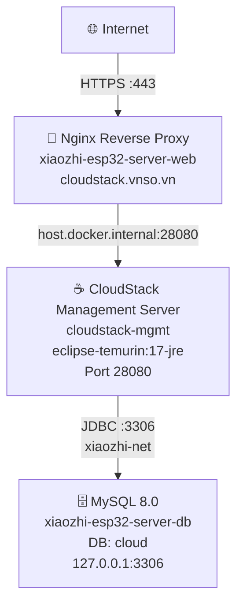
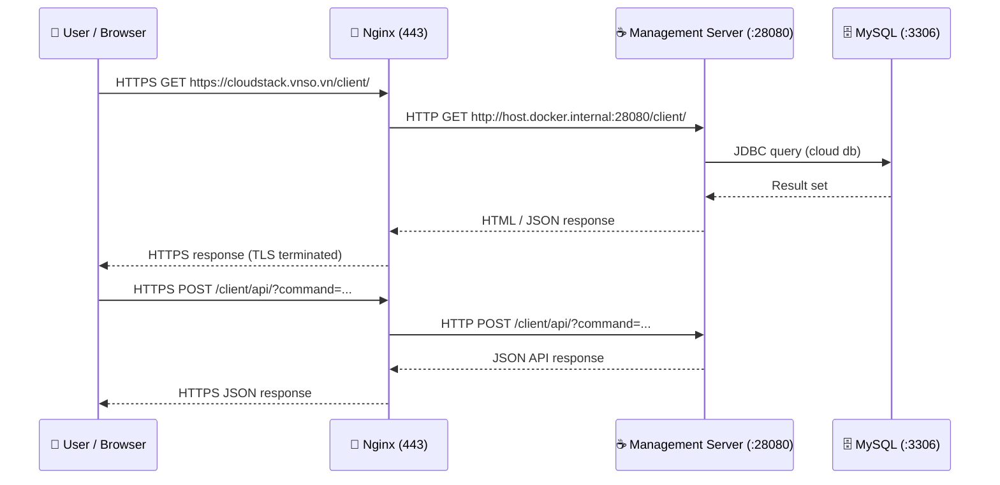
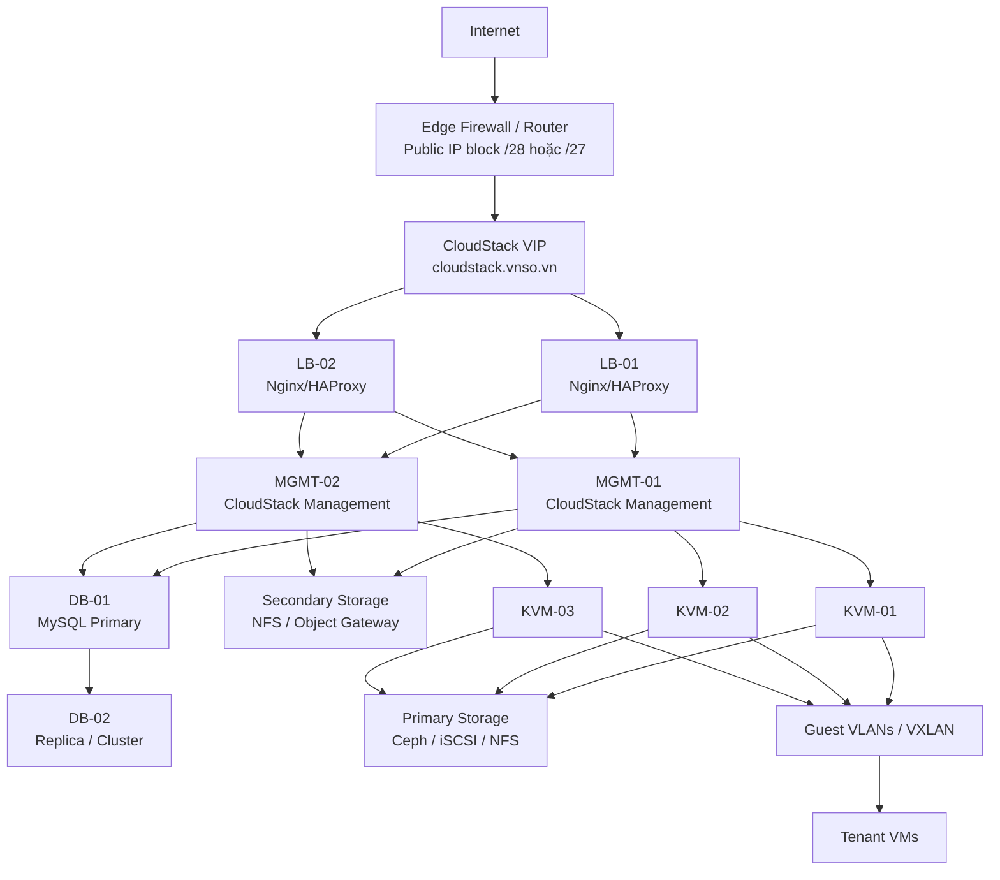
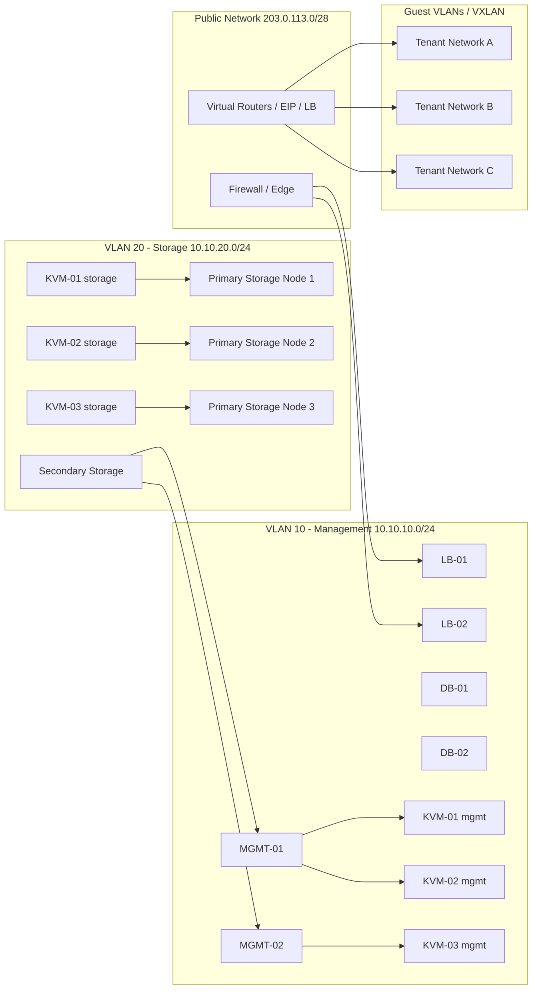

# CloudStack Infrastructure Documentation

> **Phiên bản**: Apache CloudStack 4.23.0.0-SNAPSHOT  
> **Môi trường**: Production (VPS)  
> **Cập nhật**: 2026-03-11  

---

## 1. Tổng quan kiến trúc

```
                         Internet
                             │
                      ┌──────▼──────┐
                      │  DNS Record  │
                      │cloudstack.   │
                      │  vnso.vn     │
                      └──────┬───────┘
                             │ :443 (HTTPS)
                      ┌──────▼──────────────────────────────────┐
                      │    Nginx Reverse Proxy (Docker)          │
                      │    Container: xiaozhi-esp32-server-web   │
                      │    Network:   xiaozhi-net                │
                      │                                          │
                      │  /              → redirect /client/      │
                      │  /client/       → host:28080/client/     │
                      │  /client/api/   → host:28080/client/api/ │
                      └──────────────────┬───────────────────────┘
                                         │ host.docker.internal:28080
                      ┌──────────────────▼───────────────────────┐
                      │   CloudStack Management Server           │
                      │   Container:  cloudstack-mgmt            │
                      │   Image:      cloudstack-mgmt-runtime:   │
                      │               local                       │
                      │   Base:       eclipse-temurin:17-jre     │
                      │   Port:       28080 (HTTP)               │
                      │   Network:    xiaozhi-net                │
                      │   JAR: cloud-client-ui-4.23.0.0-         │
                      │        SNAPSHOT.jar (mounted volume)     │
                      └──────────────────┬───────────────────────┘
                                         │ JDBC → :3306
                      ┌──────────────────▼───────────────────────┐
                      │   MySQL 8.0                              │
                      │   Container: xiaozhi-esp32-server-db     │
                      │   Image:     mysql:8.0                   │
                      │   DB:        cloud                       │
                      │   User:      cloud                       │
                      │   Host Port: 127.0.0.1:3306             │
                      │   Network:   xiaozhi-net                 │
                      └──────────────────────────────────────────┘
```

---

## 2. Sơ đồ mạng Docker

```
Docker Host (VPS)
│
├── Network: xiaozhi-net  (bridge, external)
│   ├── cloudstack-mgmt           ← Management Server
│   ├── xiaozhi-esp32-server-db   ← MySQL (shared DB host)
│   └── xiaozhi-esp32-server-web  ← Nginx (port 80/443 → host)
│
├── Network: xiaozhi-net / cloudstack_cloudstack-net
│
└── Host ports exposed:
    ├── 0.0.0.0:28080  → cloudstack-mgmt:28080   (HTTP API/UI)
    ├── 127.0.0.1:3306 → xiaozhi-esp32-server-db:3306
    ├── 0.0.0.0:80     → nginx:80  (HTTP → redirect HTTPS)
    └── 0.0.0.0:443    → nginx:443 (HTTPS)
```

### Mermaid (network topology)



---

## 3. Danh sách containers

| Container | Image | Ports | Network | Vai trò |
|---|---|---|---|---|
| `cloudstack-mgmt` | `cloudstack-mgmt-runtime:local` | `0.0.0.0:28080→28080` | `xiaozhi-net` | Management Server + Web UI |
| `xiaozhi-esp32-server-db` | `mysql:8.0` | `127.0.0.1:3306→3306` | `xiaozhi-net` | Database (dùng chung) |
| `xiaozhi-esp32-server-web` | `ghcr.io/trinhtanphat/xiaozhi-esp32-server:vnso_web_latest` | `0.0.0.0:80, 443` | `xiaozhi-net` | Nginx reverse proxy |

---

## 4. Cấu hình chi tiết

### 4.1 Management Server (`cloudstack-mgmt`)

| Tham số | Giá trị |
|---|---|
| Docker image | `cloudstack-mgmt-runtime:local` |
| Base image | `eclipse-temurin:17-jre` |
| JAR | `cloud-client-ui-4.23.0.0-SNAPSHOT.jar` |
| HTTP port | `28080` |
| Context path | `/client` |
| Restart policy | `unless-stopped` |
| JVM heap | `-Xms512m -Xmx2048m` |
| Timezone | `Asia/Ho_Chi_Minh` |
| Session timeout | `30 phút` |
| Cluster node IP | `127.0.0.1` |
| Cluster servlet port | `9090` |

**Volumes mounted:**

```
./client/target/cloud-client-ui-4.23.0.0-SNAPSHOT.jar → /opt/cloudstack/cloud-client-ui.jar  (ro)
./client/target/lib                                    → /opt/cloudstack/lib                  (ro)
./docker/conf                                          → /opt/cloudstack/conf                 (ro)
./docker/conf/commands.properties                      → /opt/cloudstack/commands.properties  (ro)
./scripts                                              → /opt/cloudstack/scripts               (ro)
./engine/schema/dist/systemvm-templates                → /opt/cloudstack/.../systemvm-templates (ro)
```

**Health check:**
```
Test: TCP connect 127.0.0.1:28080
Interval: 15s | Timeout: 5s | Retries: 5 | Start period: 60s
```

---

### 4.2 Database (`xiaozhi-esp32-server-db`)

| Tham số | Giá trị |
|---|---|
| Image | `mysql:8.0` |
| Database | `cloud` |
| Username | `cloud` |
| Password | `cloud` |
| Host (từ container) | `xiaozhi-esp32-server-db:3306` |
| Host (từ host OS) | `127.0.0.1:3306` |
| Connection pool | HikariCP |
| Max active connections | `250` |
| Encryption | none |
| SSL | disabled |

**Chuỗi JDBC:**
```
jdbc:mysql://xiaozhi-esp32-server-db:3306/cloud?prepStmtCacheSize=517&cachePrepStmts=true
&sessionVariables=sql_mode='STRICT_TRANS_TABLES,...'&serverTimezone=UTC
```

---

### 4.3 Nginx Reverse Proxy

**Domain:** `cloudstack.vnso.vn`  
**SSL:** Wildcard cert (`/etc/nginx/ssl/cert.crt`)

| Location | Proxy target | Ghi chú |
|---|---|---|
| `/client/api/` | `host.docker.internal:28080/client/api/` | CloudStack REST API |
| `/client/` | `host.docker.internal:28080/client/` | Web UI (Tomcat/Jetty) |
| `/` | redirect 302 `/client/` | – |
| `:80` | redirect 301 HTTPS | HTTP → HTTPS |

---

## 5. Sơ đồ luồng request



---

## 6. Các endpoint truy cập

| Endpoint | URL | Ghi chú |
|---|---|---|
| Web UI (HTTPS) | `https://cloudstack.vnso.vn/client/` | Public, qua Nginx |
| API (HTTPS) | `https://cloudstack.vnso.vn/client/api/` | REST API |
| Management Server (direct) | `http://127.0.0.1:28080/client/` | Host only, không qua Nginx |
| Database (direct) | `127.0.0.1:3306` | Host only |

**Thông tin đăng nhập mặc định UI:**
```
Username: admin
Password: password  (đổi ngay sau khi first-run)
Domain:   (để trống = ROOT)
```

---

## 7. Docker Compose sử dụng

### File: `docker-compose.prod.yml`

```bash
# Khởi động
docker compose -f docker-compose.prod.yml up -d

# Xem trạng thái
docker compose -f docker-compose.prod.yml ps

# Xem logs management server
docker logs cloudstack-mgmt -f

# Restart management server
docker compose -f docker-compose.prod.yml restart cloudstack-mgmt

# Dừng
docker compose -f docker-compose.prod.yml down
```

---

## 8. Build image từ source

### Yêu cầu
- Maven 3.6+ (hoặc dùng `mvnw` trong repo)
- JDK 17+
- Docker

### Bước 1: Build JAR (Maven)
```bash
cd /root/cloudstack
mvn -f client/pom.xml package -DskipTests -q
# JAR output: client/target/cloud-client-ui-4.23.0.0-SNAPSHOT.jar
```

### Bước 2: Build Docker image runtime
```bash
docker build -f Dockerfile.runtime -t cloudstack-mgmt-runtime:local .
```

### Bước 3: Khởi động
```bash
docker compose -f docker-compose.prod.yml up -d
```

> **Lưu ý:** `Dockerfile.prod` là multi-stage build (Maven build bên trong container) — dùng để build fully containerized, mất nhiều thời gian hơn, ít dùng cho dev cycle.

---

## 9. Cấu trúc thư mục nguồn (key paths)

```
/root/cloudstack/
├── Dockerfile.runtime          ← Docker image runtime (eclipse-temurin:17-jre)
├── Dockerfile.prod             ← Multi-stage Docker build (Maven → Tomcat)
├── docker-compose.prod.yml     ← Production compose file
├── DOCKER_SETUP.md             ← Setup notes (legacy)
├── INFRASTRUCTURE.md           ← File này
│
├── docker/
│   ├── conf/
│   │   ├── db.properties       ← Cấu hình kết nối DB
│   │   ├── server.properties   ← Cấu hình HTTP port, context path
│   │   ├── environment.properties
│   │   ├── commands.properties
│   │   ├── log4j-cloud.xml     ← Cấu hình logging
│   │   └── ehcache.xml         ← Cấu hình cache
│   └── secrets/
│       └── admin-api-key.env   ← Admin API keypair (0600, git-ignored)
│
├── client/
│   └── target/
│       ├── cloud-client-ui-4.23.0.0-SNAPSHOT.jar  ← JAR chính
│       └── lib/                                    ← Dependencies
│
├── scripts/
│   └── vnso/
│       ├── start-all.sh                    ← Start toàn bộ (dev mode)
│       ├── start-mgmt-28080.sh             ← Start management server (Jetty dev)
│       ├── start-ui-25050.sh               ← Start Vue.js UI dev server
│       ├── check-ports.sh                  ← Kiểm tra port
│       ├── rotate-admin-api-key.sh         ← Xoay vòng API key admin
│       ├── cleanup-mshost-stale.sh         ← Dọn management server hosts cũ
│       └── install-mshost-cleanup-timer.sh ← Cài cleanup timer
│
└── engine/
    └── schema/dist/systemvm-templates/     ← SystemVM templates
```

---

## 10. Các lệnh vận hành thường dùng

### Kiểm tra trạng thái
```bash
# Xem tất cả containers liên quan
docker ps | grep -E "cloudstack|xiaozhi-esp32-server-db"

# Health check
docker inspect cloudstack-mgmt --format '{{.State.Health.Status}}'

# Logs realtime
docker logs cloudstack-mgmt -f --tail=100

# Kiểm tra kết nối DB từ management server
docker exec cloudstack-mgmt bash -c "exec 3<>/dev/tcp/xiaozhi-esp32-server-db/3306 && echo OK"
```

### Kiểm tra API
```bash
# Ping API (không cần auth)
curl -s "http://127.0.0.1:28080/client/api/?command=listApis&response=json" | python3 -m json.tool | head -20

# Qua HTTPS domain
curl -k "https://cloudstack.vnso.vn/client/api/?command=listCapabilities&response=json"
```

### Kết nối database
```bash
# Từ host OS
mysql -h 127.0.0.1 -P 3306 -u cloud -pcloud cloud

# Từ bên trong container
docker exec -it xiaozhi-esp32-server-db mysql -ucloud -pcloud cloud
```

### Rotate Admin API Key
```bash
cd /root/cloudstack
./scripts/vnso/rotate-admin-api-key.sh
# Keypair được lưu tại: docker/secrets/admin-api-key.env (permissions 0600)
```

---

## 11. Troubleshooting

### Management server không start
```bash
# Xem logs chi tiết
docker logs cloudstack-mgmt 2>&1 | tail -100

# Kiểm tra DB đã sẵn sàng chưa
docker exec xiaozhi-esp32-server-db mysqladmin -ucloud -pcloud ping

# Kiểm tra cấu hình DB trong container
docker exec cloudstack-mgmt cat /opt/cloudstack/conf/db.properties | grep "db.cloud.host"
```

### API trả về 502
```bash
# Kiểm tra backend đang lắng nghe
ss -tlnp | grep 28080

# Kiểm tra Nginx proxy config
docker exec xiaozhi-esp32-server-web nginx -T | grep -A 20 "cloudstack.vnso.vn"
```

### Lỗi "Unable to start jetty" hoặc port conflict
```bash
./scripts/vnso/check-ports.sh 28080
```

### First-run: database schema chưa được tạo
```bash
# Xem CloudStack có chạy Flyway/schema init không
docker logs cloudstack-mgmt 2>&1 | grep -i "schema\|migrate\|flyway\|liquibase"

# Nếu cần init thủ công:
docker exec cloudstack-mgmt java -cp /opt/cloudstack/cloud-client-ui.jar:/opt/cloudstack/lib/* \
  com.cloud.upgrade.dao.VersionDaoImpl
```

---

## 12. Bảo mật

| Hạng mục | Trạng thái | Ghi chú |
|---|---|---|
| HTTPS | ✅ Bật | TLS terminated tại Nginx |
| HTTP → HTTPS redirect | ✅ Bật | 301 redirect |
| DB password | ⚠️ Weak | `cloud/cloud` — chỉ dùng internal network |
| DB exposed public | ✅ OK | Chỉ bind `127.0.0.1:3306` |
| Admin API key | ✅ OK | Stored `0600` tại `docker/secrets/` |
| MGMT port public | ⚠️ Hạn chế | `0.0.0.0:28080` — nên firewall block external |
| SSL cert | ✅ Wildcard | `*.vnso.vn` |

> **Khuyến nghị**: Thêm firewall rule block port `28080` từ external, chỉ cho phép từ localhost và Nginx container.

```bash
# Block port 28080 từ external (giữ internal OK)
ufw deny in on eth0 to any port 28080
```

---

## 13. Monitoring

CloudStack Management Server expose log tại:
- **Docker logs**: `docker logs cloudstack-mgmt`
- **Access log**: `/tmp/cloudstack-access.log` (bên trong container)
- **Cấu hình log**: `docker/conf/log4j-cloud.xml`

```bash
# Theo dõi error logs
docker logs cloudstack-mgmt 2>&1 | grep -i "error\|warn\|exception" | tail -50

# Theo dõi access log trong container
docker exec cloudstack-mgmt tail -f /tmp/cloudstack-access.log
```

---

## 14. Quy mô hạ tầng hiện tại

### 14.1 Những gì đang có thực tế

Theo cấu hình đang chạy hiện tại, cụm này mới ở mức **single-host management deployment**, chưa phải một cụm CloudStack hạ tầng đầy đủ.

| Nhóm tài nguyên | Số lượng hiện có | Ghi chú |
|---|---|---|
| VPS / Docker host | `1` | Toàn bộ dịch vụ đang chạy trên cùng một máy chủ |
| Reverse proxy | `1` container | `xiaozhi-esp32-server-web` dùng chung với các dịch vụ khác |
| CloudStack management server | `1` container | `cloudstack-mgmt` |
| Database server | `1` container | `xiaozhi-esp32-server-db`, đang là MySQL dùng chung |
| Hypervisor host (KVM/Xen/VMware) | `0` | Chưa thấy host compute thực tế cho CloudStack |
| Primary storage | `0` chuyên dụng | Chưa thấy NFS/Ceph/iSCSI dành riêng cho VM disks |
| Secondary storage | `0` chuyên dụng | Chưa thấy storage cho template/ISO/snapshot |
| System VM network | `0` tách riêng | Chưa có mạng dành riêng cho SSVM/CPVM/VR |
| Public IP pool | `0` mô tả rõ ràng | Chưa có dải IP public cấp cho guest/VR |
| Monitoring stack riêng cho CloudStack | `0` | Mới có mức xem Docker logs |
| Backup/DR riêng cho CloudStack | `0` | Chưa thấy policy backup DB/config/template |

### 14.2 Kết luận nhanh

Trạng thái hiện tại đủ để:
- Chạy management UI/API.
- Kiểm thử cấu hình, build, đăng nhập, gọi API.
- Làm môi trường lab hoặc pre-production.

Trạng thái hiện tại **chưa đủ** để:
- Vận hành hạ tầng IaaS production cho tenant chạy VM thật.
- Cấp phát VM ổn định qua zone/pod/cluster/host.
- Chạy HA cho management plane hoặc database.
- Tách biệt mạng management, storage, guest và public đúng chuẩn triển khai CloudStack.

---

## 15. Hạ tầng tối thiểu để triển khai vận hành CloudStack

### 15.1 Mô hình tối thiểu cho lab / pilot

| Thành phần | Số lượng tối thiểu | Khuyến nghị |
|---|---|---|
| Management server | `1` | 4 vCPU, 8-16 GB RAM, 100 GB SSD |
| Database server | `1` | Có thể chung máy với management ở giai đoạn pilot, nhưng nên tách nếu tải tăng |
| KVM host | `2` | Mỗi host nên từ 16 vCPU, 64 GB RAM, SSD/NVMe |
| Secondary storage | `1` | NFS share hoặc object storage gateway, tối thiểu 500 GB |
| Primary storage | `1` | NFS/iSCSI/Ceph, tùy mô hình |
| Reverse proxy / LB | `1` | Nginx/HAProxy |
| Public IP block | `1` dải | Tối thiểu `/29` hoặc `/28` nếu có NAT/public services |

### 15.2 Mô hình production tối thiểu nên có

| Thành phần | Số lượng khuyến nghị | Ghi chú |
|---|---|---|
| Management server | `2` | Active-active sau LB |
| Database | `2` | MySQL primary-replica hoặc InnoDB Cluster |
| Load balancer / reverse proxy | `2` | Active-standby hoặc external LB |
| KVM host | `3` trở lên | Đủ để bảo trì xoay vòng và giảm single point of failure |
| Secondary storage | `1-2` | Có backup/offsite sync |
| Primary storage | `2` path hoặc distributed | Ceph là lựa chọn phổ biến nếu cần HA |
| Monitoring/logging | `1` stack | Prometheus + Grafana + Loki/ELK |
| Backup server | `1` | Lưu DB dump, configs, templates quan trọng |

### 15.3 Mức tài nguyên tham khảo

| Node | CPU | RAM | Disk | NIC |
|---|---|---|---|---|
| Management node | 4-8 vCPU | 8-16 GB | 100-200 GB SSD | 1-2 x 1GbE |
| Database node | 4-8 vCPU | 16-32 GB | SSD/NVMe, IOPS cao | 1-2 x 1GbE |
| KVM compute host | 16-32 cores | 64-256 GB | SSD/NVMe cho OS, storage riêng cho VM | 2 x 10GbE nếu có |
| Storage node | 8-16 cores | 32-64 GB | Nhiều SSD/HDD tùy workload | 10GbE khuyến nghị |

---

## 16. Thiết kế mạng cần có

### 16.1 Các lớp mạng nên tách riêng

| Mạng | Bắt buộc | Mục đích |
|---|---|---|
| Management network | Có | CloudStack management ↔ hypervisor hosts |
| Storage network | Nên có | Lưu lượng NFS/Ceph/iSCSI, tránh tranh chấp với guest traffic |
| Guest network | Có | VM tenant traffic |
| Public network | Có nếu cấp Internet/public IP | VR, EIP, LB, public services |
| Out-of-band / IPMI | Nên có | Quản trị phần cứng, power cycle |

### 16.2 Tối thiểu cần chuẩn bị về network

| Hạng mục | Nên có |
|---|---|
| ToR switch | `1-2` thiết bị |
| VLAN | Tách VLAN cho management, storage, guest, public |
| Uplink Internet | Có public IP route được tới edge |
| Firewall | ACL rõ giữa management plane và public plane |
| DNS | Bản ghi cho UI/API, hostnames management/compute |
| NTP | Đồng bộ thời gian cho tất cả node |

### 16.3 Ví dụ phân hoạch mạng

| Zone / Network | Ví dụ subnet | Ghi chú |
|---|---|---|
| Management | `10.10.10.0/24` | Dành cho mgmt server và KVM hosts |
| Storage | `10.10.20.0/24` | Dành cho NFS/Ceph/iSCSI |
| Guest | `10.20.0.0/16` | Chia nhỏ theo VLAN/VXLAN cho tenant |
| Public | `203.x.x.x/29` hoặc lớn hơn | Dải IP public gán cho VR/NAT/LB |
| OOB/IPMI | `10.10.30.0/24` | Chỉ dành cho quản trị phần cứng |

---

## 17. Những thành phần còn thiếu để vận hành thực tế

### 17.1 Thiếu ở lớp hạ tầng

- Chưa có **compute hosts** để nhận cluster/pod và chạy VM.
- Chưa có **primary storage** dành cho volume của máy ảo.
- Chưa có **secondary storage** cho template, ISO, snapshot.
- Chưa có **public IP pool** và thiết kế L2/L3 rõ cho guest/public traffic.
- Chưa có **phân tách network planes** giữa management, storage, guest.

### 17.2 Thiếu ở lớp vận hành

- Chưa có **backup policy** cho MySQL, cấu hình `docker/conf`, secret files.
- Chưa có **monitoring/alerting** cho JVM, MySQL, API latency, disk usage, host health.
- Chưa có **centralized logging** để tra lỗi đa node.
- Chưa có **HA** cho management server và database.
- Chưa có **capacity planning** cho số lượng VM, template, snapshot và IOPS storage.
- Chưa có **runbook vận hành**: start/stop, rollback, rotate key, restore DB, disaster recovery.

### 17.3 Thiếu ở lớp bảo mật

- Cần đổi mật khẩu DB mặc định `cloud/cloud`.
- Cần chặn truy cập public trực tiếp vào port `28080`.
- Cần phân quyền admin/user và xoay vòng secret định kỳ.
- Nên có WAF/rate-limit cơ bản ở Nginx nếu public Internet.
- Nên bật backup mã hóa và audit logging cho thao tác quản trị.

---

## 18. Checklist triển khai vận hành

### 18.1 Nếu mục tiêu là lab / demo

- 1 management node.
- 1 MySQL node.
- 2 KVM hosts.
- 1 secondary storage.
- 1 dải public IP nhỏ.
- 1 reverse proxy + SSL.

### 18.2 Nếu mục tiêu là production nhỏ

- 2 management nodes sau LB.
- 2 database nodes.
- 3 KVM hosts.
- 1 secondary storage có backup.
- 1 primary storage HA hoặc distributed.
- VLAN tách management, storage, guest, public.
- Monitoring, logging, backup, restore test đầy đủ.

### 18.3 Ưu tiên triển khai tiếp theo cho hệ hiện tại

1. Tách database CloudStack ra khỏi container dùng chung hiện tại.
2. Dựng ít nhất 2-3 KVM hosts để CloudStack có compute thực.
3. Chuẩn bị secondary storage và primary storage riêng.
4. Thiết kế lại network với VLAN/public IP pool rõ ràng.
5. Chặn public access vào `28080`, chỉ đi qua Nginx/LB.
6. Bổ sung monitoring, backup và runbook vận hành.

---

## 19. BOM triển khai đề xuất

Phần này là **BOM tham chiếu** cho mô hình production nhỏ, đủ để chạy CloudStack theo kiến trúc 2 management, 3 KVM, storage riêng và có khả năng vận hành ổn định hơn hệ hiện tại.

### 19.1 Danh sách máy chủ đề xuất

| ID | Vai trò | Số lượng | Cấu hình tối thiểu | Cấu hình khuyến nghị |
|---|---|---|---|---|
| `LB-01`, `LB-02` | Reverse proxy / Load balancer | `2` | 2 vCPU, 2 GB RAM, 40 GB SSD | 2 vCPU, 4 GB RAM, HAProxy/Nginx keepalived |
| `MGMT-01`, `MGMT-02` | CloudStack Management Server | `2` | 4 vCPU, 8 GB RAM, 100 GB SSD | 8 vCPU, 16 GB RAM, 200 GB SSD |
| `DB-01`, `DB-02` | MySQL / MariaDB cluster | `2` | 4 vCPU, 16 GB RAM, 200 GB SSD | 8 vCPU, 32 GB RAM, NVMe RAID1 |
| `KVM-01`, `KVM-02`, `KVM-03` | Compute hosts | `3` | 16 cores, 64 GB RAM, 2 x 480 GB SSD | 24-32 cores, 128-256 GB RAM, SSD/NVMe |
| `STO-01` | Secondary storage | `1` | 8 vCPU, 16 GB RAM, 2 TB usable | 8-16 vCPU, 32 GB RAM, 4 TB usable |
| `PRI-01..03` | Primary storage cluster | `3` nếu dùng Ceph | 8 cores, 32 GB RAM, 4 x SSD/HDD | 16 cores, 64 GB RAM, NVMe + 10GbE |
| `MON-01` | Monitoring + logging + backup orchestrator | `1` | 4 vCPU, 8 GB RAM, 200 GB SSD | 8 vCPU, 16 GB RAM, 500 GB SSD |
| `OOB-SW` | OOB/IPMI switch hoặc mạng quản trị | `1` | Có | Nên tách riêng khỏi data plane |

### 19.2 BOM theo nhóm thiết bị

| Nhóm | Hạng mục | Số lượng | Ghi chú |
|---|---|---|---|
| Compute | KVM hypervisor servers | `3` | Tối thiểu để có cụm compute cơ bản |
| Management | CloudStack management nodes | `2` | Tránh single point of failure |
| Database | MySQL servers | `2` | Primary-replica hoặc InnoDB Cluster |
| Network | ToR switches | `2` | Khuyến nghị nếu muốn giảm rủi ro đơn điểm |
| Network | Firewall/router edge | `1-2` | Tùy hạ tầng DC/VPS/private cloud |
| Storage | Secondary storage appliance/server | `1` | NFS là đơn giản nhất để bắt đầu |
| Storage | Primary storage backend | `1` hệ thống | NFS, iSCSI hoặc Ceph |
| Public IP | Dải IP public | `1` block | Tối thiểu `/28`, tốt hơn `/27` |
| Ops | Monitoring/logging node | `1` | Có thể gộp trong giai đoạn đầu |
| Ops | Backup target | `1` | Có thể là NAS hoặc object storage |

### 19.3 Ước tính sức chứa ban đầu

Giả sử cụm có `3` KVM hosts, mỗi host `128 GB RAM`, `24 cores`, và dành khoảng `20%` overhead cho hypervisor/system VM:

| Tài nguyên | Tổng thô | Trừ overhead | Dùng được cho tenant |
|---|---|---|---|
| vCPU | `72 cores` | còn khoảng `58-60 cores` | khoảng `110-180 vCPU` nếu oversubscribe vừa phải |
| RAM | `384 GB` | còn khoảng `300 GB` | khoảng `250-300 GB` cấp phát an toàn |
| Local/cache disk | tùy host | tùy cấu hình | không nên dùng làm primary chính nếu production |

Mức này phù hợp cho:
- Cụm production nhỏ.
- Vài chục đến khoảng 100 VM cỡ nhỏ-trung bình, tùy workload.
- Môi trường nội bộ, SaaS nhỏ, hoặc private cloud giai đoạn đầu.

---

## 20. IP Plan, VLAN Plan và sơ đồ production chuẩn

### 20.1 VLAN plan mẫu

| VLAN | Tên | Subnet mẫu | Thành phần |
|---|---|---|---|
| `10` | Management | `10.10.10.0/24` | LB, MGMT, DB, KVM management NIC |
| `20` | Storage | `10.10.20.0/24` | KVM storage NIC, NFS/Ceph/iSCSI |
| `30` | Guest / Tenant A | `10.20.10.0/24` | Guest traffic |
| `31` | Guest / Tenant B | `10.20.11.0/24` | Guest traffic |
| `40` | Public / Edge | `203.0.113.0/28` | VR, LB, EIP, SNAT/DNAT |
| `50` | OOB/IPMI | `10.10.30.0/24` | iDRAC/iLO/IPMI |

### 20.2 IP plan mẫu chi tiết

| Hostname | Vai trò | VLAN | IP mẫu |
|---|---|---|---|
| `lb-01` | Load balancer | 10 | `10.10.10.10` |
| `lb-02` | Load balancer | 10 | `10.10.10.11` |
| `cloudstack-vip` | VIP cho UI/API | 10 | `10.10.10.12` |
| `mgmt-01` | Management server | 10 | `10.10.10.21` |
| `mgmt-02` | Management server | 10 | `10.10.10.22` |
| `db-01` | Database primary | 10 | `10.10.10.31` |
| `db-02` | Database replica | 10 | `10.10.10.32` |
| `kvm-01-mgmt` | KVM host 1 management | 10 | `10.10.10.41` |
| `kvm-02-mgmt` | KVM host 2 management | 10 | `10.10.10.42` |
| `kvm-03-mgmt` | KVM host 3 management | 10 | `10.10.10.43` |
| `kvm-01-storage` | KVM host 1 storage | 20 | `10.10.20.41` |
| `kvm-02-storage` | KVM host 2 storage | 20 | `10.10.20.42` |
| `kvm-03-storage` | KVM host 3 storage | 20 | `10.10.20.43` |
| `secstor-01` | Secondary storage | 20 | `10.10.20.20` |
| `ceph-01` | Primary storage node 1 | 20 | `10.10.20.31` |
| `ceph-02` | Primary storage node 2 | 20 | `10.10.20.32` |
| `ceph-03` | Primary storage node 3 | 20 | `10.10.20.33` |
| `fw-edge` | Firewall / edge gateway | 40 | `203.0.113.1` |

### 20.3 Public IP block mẫu

| Dải IP | Mục đích |
|---|---|
| `203.0.113.2` | VIP public cho CloudStack UI/API nếu publish trực tiếp |
| `203.0.113.3-203.0.113.6` | VR / NAT / LB rules |
| `203.0.113.7-203.0.113.12` | EIP cho tenant workloads |
| `203.0.113.13-203.0.113.14` | Dự phòng / mở rộng |

### 20.4 Sơ đồ production đề xuất



### 20.5 Sơ đồ topology theo lớp mạng



### 20.6 Mapping thiết bị sang khái niệm CloudStack

| Khái niệm CloudStack | Thiết bị / node tương ứng |
|---|---|
| Region | 1 region duy nhất |
| Zone | 1 zone production |
| Pod | 1 pod chính hoặc 1 pod mỗi rack |
| Cluster | 1 cluster KVM gồm `KVM-01..03` |
| Host | 3 hypervisor hosts |
| Secondary storage | `STO-01` |
| Primary storage | `PRI-01..03` hoặc hệ NFS/iSCSI |
| Management servers | `MGMT-01`, `MGMT-02` |
| Edge / API endpoint | `LB-01`, `LB-02`, VIP `cloudstack.vnso.vn` |

### 20.7 Triển khai theo giai đoạn

| Giai đoạn | Hạng mục |
|---|---|
| Phase 1 | 2 management, 1 DB primary, 3 KVM, 1 secondary storage, 1 primary storage |
| Phase 2 | Thêm DB replica, thêm LB thứ 2, backup automation, monitoring |
| Phase 3 | Thêm Ceph/distributed storage, thêm compute hosts, DR/offsite backup |

### 20.8 Những gì anh có thể chốt ngay để bắt đầu mua sắm / cấp phát

1. `2` máy management.
2. `2` máy database.
3. `3` máy KVM compute.
4. `1` hệ storage secondary.
5. `1` hệ storage primary.
6. `2` LB hoặc `1` LB + `1` standby.
7. `2` switch nếu muốn giảm rủi ro đơn điểm.
8. `1` block public IP tối thiểu `/28`.
9. `4` VLAN tối thiểu: management, storage, guest, public.

---

*Tài liệu này được tạo tự động từ cấu hình thực tế của hệ thống.*
